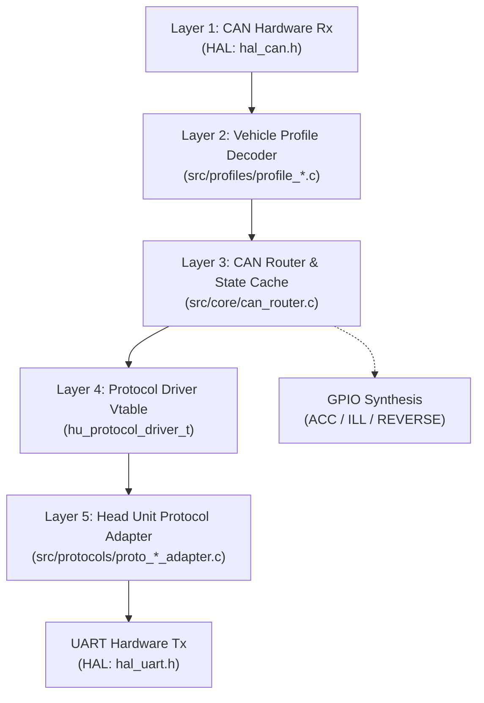

# OpenCanbox Core

**Portable, deterministic C99 firmware for CAN-to-Android automotive protocol translation and reverse engineering.**


---

## Project Summary

OpenCanbox Core is a production-grade firmware platform enabling seamless integration between vehicle CAN bus networks and Android head units from major manufacturers (Hiworld, Raise, Bagoo, Simple Soft). The codebase provides a complete, portable implementation of CAN protocol translation, reverse engineering, and automotive telemetry synthesis without dynamic memory allocation, achieving deterministic real-time operation across diverse microcontroller architectures.

The project serves three primary use cases:

1. **CAN Reverse Engineering:** Documented, verified CAN2004/CAN2010 protocol decoders for Peugeot/PSA, VAG, Toyota, and other platforms.
2. **Embedded Integration:** Portable firmware deployable across Linux hosts, STM32F103, ESP32, AVR, and Nuvoton architectures without code modification.
3. **Automotive Protocol Research:** Complete bidirectional Android head unit protocol implementations (Hiworld, Raise, Bagoo) with verifiable state machines and handshake protocols.

---

## Design Goals & Core Principles

### Architectural Pillars

**Portability without Compromise**
: All vehicle decoders and protocol parsers compile to standard C99 (`-std=c99 -Wall -Wextra -Werror`). Microcontroller-specific logic is isolated to hardware abstraction layers (`include/hal/`), allowing identical core firmware to run on Linux, STM32, ESP32, and other platforms without source modification.

**Deterministic Real-Time Operation**
: Zero heap allocation (`malloc` / `calloc` / `free` strictly prohibited throughout core layers) guarantees predictable memory footprint and interrupt safety. Lock-free, power-of-two ring buffers enable safe producer-consumer execution between hardware ISRs and main event loops without mutexes or RTOS primitives.

**CAN2004 Ground Truth Only**
: All vehicle profiles strictly implement verified, documented CAN specifications. Speculative or unconfirmed signal decoders are explicitly prohibited; unimplemented frames are tracked in `doc/TODO_PROGRESS.md` until user-provided verification is available. This prevents the common reverse-engineering pitfall of mixing CAN2004 (Peugeot 407 @ 125 kbps) with CAN2010 definitions.

**Hardware Abstraction Discipline**
: Vehicle decoders (`src/profiles/`), protocol parsers (`src/protocols/`), and the central router (`src/core/`) never import hardware-specific headers. Device drivers are capsulized in `include/hal/*.h`, maintaining complete MCU independence.

**Bandwidth-Aware Throttling**
: State-caching delta filter preserves > 85% idle margin on 38,400 baud serial links by classifying telemetry into frequency tiers (Event-Driven < 10 ms, Dynamic 5–10 Hz, Periodic 1 Hz, Infrequent 30 s).

---

## Why OpenCanbox Core?

### Differentiators

**Verified CAN Reverse Engineering**
Extensive documented CAN2004 protocol mappings for Peugeot 407 and PSA platforms, produced through systematic bus analysis and cross-validated against factory specifications. No guesswork; every signal has a known source and scale factor.

**Multi-Protocol Automotive Support**
Production implementations of Hiworld, Raise, and Bagoo Android head unit protocols with complete uplink (vehicle → head unit) and downlink (head unit → vehicle) command handling, including climate control, steering wheel controls, and trip computer reset sequences.

**Genuinely Portable Firmware**
Most CAN-to-Android adapters are fork-and-modify projects hardcoded to a specific MCU and head unit protocol. OpenCanbox Core compiles identically across Linux (SocketCAN), STM32F103 (bxCAN), ESP32 (TWAI), AVR (MCP2515), and Nuvoton (Bosch C_CAN), with vehicle profiles and protocol drivers unchanged.

**Simulation-First Development**
Full desktop simulation on Linux using virtual CAN (`vcan0`) and POSIX pseudo-terminals enables rapid protocol development, test automation, and verification without hardware. Identical code paths run in simulation and on hardware.

**Automotive Determinism**
Strict C99, zero dynamic allocation, and lock-free queues provide predictable interrupt latencies and memory behavior required for safety-critical automotive applications.

**Research-Grade Documentation**
Complete reverse-engineering notes, protocol specifications, and hardware wiring guides enable reproducible research and collaborative protocol discovery.

---

## Architecture Overview

### 5-Layer Processing Pipeline

All features traverse a strictly layered architecture, ensuring protocol and vehicle independence:



**Layer 1: CAN Reception**
Hardware drivers (`hal_stm32/`, `hal_esp32/`, `hal_native/`) ingest raw CAN frames and deposit them into lock-free SPSC ring buffers, decoupling ISR timing from main-loop processing.

**Layer 2: Vehicle Profile Decoding**
Profile-specific decoders (`src/profiles/profile_peugeot_407.c`, `profile_psa_generic.c`) translate manufacturer bitfields and endianness into a normalized `vehicle_state_t` canonical structure. All multi-byte reads use safe helpers (`read_be16`, `read_le16`, `read_be32`, `read_le32`) with boundary checking.

**Layer 3: CAN Router & State Cache**
Central state machine (`src/core/can_router.c`) maintains cumulative vehicle state, performs differential change detection, and dispatches events according to frequency classification (Class A: immediate < 10 ms; Class B: throttled 5–10 Hz; Class C: periodic 1 Hz; Class D: infrequent 30 s).

**Layer 4: Protocol Driver Interface**
Dynamic vtable dispatch (`hu_protocol_driver_t`) decouples vehicle profiles from Android head unit protocols, enabling identical profiles to emit Hiworld, Raise, or Bagoo packets without modification.

**Layer 5: Protocol Adaptation & Transmission**
Protocol-specific serializers (`src/protocols/proto_hiworld_adapter.c`, `proto_raise_adapter.c`) convert canonical state into target protocol frames with checksums, framing, and escape sequences. Frames transmit via HAL UART.

**Physical GPIO Synthesis**
Parallel event dispatch synthesizes dedicated $+12\text{V}$ output lines (REVERSE: instant camera trigger, ILL: illumination dimming, ACC: switched accessory wake) for head units lacking native CAN output capability.

---

### System Diagram

```
┌─────────────────────────────────────────────────────────────────────────┐
│       Android Head Unit Protocol Engine                                 │
│  - Dynamic protocol dispatch (Hiworld / Raise / Bagoo)                  │
│  - Bidirectional packet framing & checksum synthesis                    │
│  - Downlink command parsing & uplink telemetry serialization            │
└─────────────────────────────────────────────────────────────────────────┘
                              ▲
                              │ (Canonical vehicle_state_t)
                              ▼
┌─────────────────────────────────────────────────────────────────────────┐
│       CAN Router & State Cache Engine                                   │
│  - Vehicle matrix decoders (PSA, VAG, Toyota profiles)                  │
│  - Normalized state tracking & differential change detection            │
│  - Rate-limited dispatch (38,400 baud preservation)                     │
└─────────────────────────────────────────────────────────────────────────┘
            │                                            │
            ▼                                            ▼
  ┌──────────────────────┐              ┌──────────────────────────┐
  │  Hardware Abstraction │              │  GPIO Output Drivers     │
  │  - CAN (hal_can.h)    │              │  - ACC (12V Wake-up)     │
  │  - UART (hal_uart.h)  │              │  - ILL (Illumination)    │
  │  - GPIO (hal_gpio.h)  │              │  - REVERSE (Camera)      │
  │  - System (hal_sys.h) │              └──────────────────────────┘
  └──────────────────────┘
          │          │
          ▼          ▼
  ┌─────────┐  ┌─────────┐    ┌─────────┐    ┌──────────┐
  │ Linux   │  │ STM32   │    │ ESP32   │    │ Nuvoton  │
  │SocketCAN   bxCAN/LL   TWAI/ESP-IDF  C_CAN/Custom
  │ pty     │  │ USART   │    │ UART    │    │ UART     │
  │ GPIO    │  │ GPIO    │    │ GPIO    │    │ GPIO     │
  └─────────┘  └─────────┘    └─────────┘    └──────────┘
```

---

## Supported Protocols & Vehicle Profiles

### Android Head Unit Protocols

| Protocol | Framing | Baud Rate | Capability | Status |
| :--- | :--- | :--- | :--- | :--- |
| **Hiworld** | `0x5A 0xA5` | 38,400 / 115,200 | Full bidirectional | Production (SWC, Climate, Trip, Radar, Doors, Mileage) |
| **Raise** | `0x2E` | 38,400 | Full bidirectional | Production (SWC, Doors, Steering Angle, Speed/RPM, Settings) |
| **Bagoo** | `0xFD` / `0xD5` | 38,400 | Bidirectional | Baseline (SWC, Doors, Version Query) |
| **Simple Soft** | `0xAA 0x55` | 38,400 | Bidirectional | Planned |

### Vehicle Profiles

| Profile | Vehicle / Generation | Bus Architecture | Coverage |
| :--- | :--- | :--- | :--- |
| `VEHICLE_PROFILE_PEUGEOT_407` | Peugeot 407 (2004–2011) | PSA CAN2004 @ 125 kbps | Engine, Climate, Doors, HVAC, Steering, Trip, Parking, TPMS |
| `VEHICLE_PROFILE_PSA_GENERIC` | Peugeot 307/308, Citroen C4/C5 | CAN2004 & CAN2010 | Extended PSA Comfort + Powertrain matrix |
| `VEHICLE_PROFILE_VAG_PQ` | VW Golf 5/6, Passat B6, Octavia 2 | VAG PQ35/46 @ 100/500 kbps | Steering wheel, door state, ignition, door unlock |

---

## Telemetry Coverage

The platform captures comprehensive automotive telemetry across multiple functional domains:

### Input (Vehicle → Head Unit)

**Steering Wheel Controls (SWC)**
Volume (up/down), seek/track (next/previous), source/mode selection, mute, roller inputs, trip/menu navigation.

**Climate Control (HVAC)**
Driver/passenger setpoint temperatures, fan speed, blow direction modes (windshield, face, feet), AC enable, auto mode, recirculation, defrost status, and full downlink touchscreen control.

**Vehicle Status**
Four-door status (FL, FR, RL, RR), trunk, hood, handbrake, seatbelt, ignition state, battery voltage with immediate change detection.

**Powertrain Telemetry**
Engine RPM, vehicle speed, throttle position, gear selection (Park/Reverse/Neutral/Drive), transmission mode.

**Trip Computer & Fuel**
Instantaneous and average fuel consumption (L/100km), trip distance, average speed, cruising range (distance-to-empty), fuel tank level and range.

**Tire Pressure Monitoring (TPMS)**
Four-wheel independent numeric pressures (bar/psi), status indication (nominal/low/puncture), with event-driven alarm dispatch.

**Parking Assistance**
Front/rear 4-zone obstacle distances (cm), buzzer warning state, synthesized reverse camera trigger output.

**Environmental**
Ambient air temperature, interior cabin temperature, solar radiation (where available).

**Steering Angle Sensor (SAS)**
Real-time steering wheel angle (−720° to +720°) up to 10 Hz for dynamic reverse parking guides.

### Output (Head Unit → Vehicle)

**Climate Control Commands**
Setpoint adjustments (driver/passenger), fan speed control, mode switching, AC/recirculation toggle.

**Trip Computer Management**
Trip reset commands (Trip 1 / Trip 2), consumption averaging restart.

**Vehicle Settings Sync**
BSI user profiles, language selection, display preferences, lighting modes.

---

## Development Workflow

### Desktop Simulation (Linux + SocketCAN)

1. **Configure virtual CAN interface:**
   ```bash
   sudo modprobe vcan
   sudo ip link add dev vcan0 type vcan
   sudo ip link set up vcan0
   ```

2. **Build and run the native simulator:**
   ```bash
   CANBOX_CAN_IFACE="vcan0" pio run -e native_test -t exec
   ```

3. **Monitor simulated head unit UART output:**
   ```bash
   xxd -c 16 < /tmp/ttyCanbox
   ```

4. **Inject test CAN frames from a third terminal:**
   ```bash
   # Steering wheel volume up (Peugeot 407, ID 0x128)
   cansend vcan0 128#0100
   
   # Driver door open + handbrake engaged (ID 0x036)
   cansend vcan0 036#0100000000000000
   
   # Reverse gear engaged (ID 0x0F6)
   cansend vcan0 0F6#0000000000000080
   ```

### Automated Testing

**Unit Tests (Protocol Parsers, Vehicle Decoders)**
```bash
pio test -e native_test_runner
```

**Integration Tests (CAN-to-UART End-to-End + Recorded Scenarios)**
```bash
pio test -e integration_test
```

### Hardware Deployment

**STM32F103 Target:**
```bash
pio run -e stm32_cbox
```

**ESP32 Target:**
```bash
pio run -e esp32_cbox
```

**Standalone Nuvoton NUC131:**
```bash
make -f Makefile.nuc131
```

---

## Bench Testing Tools

The `tools/` directory provides Python utilities for automated protocol validation and live debugging:

### Live E2E Logger (`canbox_e2e_logger.py`)

Captures bidirectional CAN and serial UART traffic, decodes protocol frames in real time, and generates timestamped session logs:

```bash
# Desktop simulation
python3 tools/canbox_e2e_logger.py --can vcan0 --serial /tmp/ttyCanbox

# Hardware at standard baud rate
python3 tools/canbox_e2e_logger.py --can can0 --serial /dev/ttyUSB0 --baud 38400
```

### Automated Scenario Testing (`canbox_bench_e2e.py`)

Executes predefined CAN frame sequences and verifies correct protocol output on UART:

```bash
python3 tools/canbox_bench_e2e.py --can vcan0 --serial /tmp/ttyCanbox
```

### Protocol Frame Analyzer (`diff_canbox_frames.py`)

Compares differential CAN and serial traffic for regression detection:

```bash
python3 tools/diff_canbox_frames.py session_baseline.log session_current.log
```

### Manual Frame Injection (`canbox_manual_test.py`)

Interactive terminal for real-time CAN frame injection and UART monitoring.

### Serial Packet Replay (`replay_serial.py`)

Replays recorded UART sessions for protocol validation and debugging.

---

## Project Structure

```
canbox-core/
├── platformio.ini                           # Multi-target build configuration
├── Makefile.nuc131                          # Standalone Nuvoton NUC131 build
├── development_guidelines.md                # Engineering standards & frequency classification
├── AGENTS.md                                # AI agent workflow constraints
├── README.md                                # This file
│
├── doc/                                     # Complete reverse-engineering & protocol specs
│   ├── TODO_PROGRESS.md                     # Implementation roadmap
│   ├── HARDWARE_GPIO_REVERSE_ILL_ACC.md     # GPIO output driver specification
│   ├── MANUAL_TESTING_WITH_HEADUNIT.md      # Hardware workbench guide
│   ├── CANBOX_SPEC_HIWORLD_*.md             # Hiworld protocol specifications
│   ├── PEUGEOT_RT4_TRIP_RESET.md            # Downlink trip computer protocol
│   └── PEUGEOT_RT4_CAR_CONFIG.md            # BSI settings & car personalization
│
├── include/
│   ├── core/
│   │   ├── can_router.h                     # State machine & change detection
│   │   ├── ring_buffer.h                    # Lock-free SPSC queue
│   │   └── vehicle_profile.h                # Profile registry & dispatcher
│   │
│   ├── hal/
│   │   ├── hal_can.h                        # CAN bus abstraction
│   │   ├── hal_uart.h                       # Serial UART abstraction
│   │   ├── hal_gpio.h                       # GPIO & output line control
│   │   └── hal_system.h                     # Timers & system utilities
│   │
│   ├── profiles/
│   │   └── peugeot_407.h                    # Peugeot 407 CAN matrix definitions
│   │
│   └── protocols/
│       ├── hu_protocol.h                    # Protocol serializer dispatcher
│       ├── hu_protocol_driver.h             # Dynamic protocol vtable
│       ├── canbox_parser.h                  # Streaming binary parser
│       ├── proto_hiworld.h                  # Hiworld packet serializers
│       ├── proto_raise.h                    # Raise packet serializers
│       ├── proto_bagoo.h                    # Bagoo packet serializers
│       ├── hiworld_car_mapping.h            # Hiworld model index mappings
│       └── raise_car_mapping.h              # Raise model index mappings
│
├── src/
│   ├── main.c                               # Main entry (Linux + STM32)
│   ├── main_esp32.c                         # ESP32/FreeRTOS main entry
│   │
│   ├── core/
│   │   ├── can_router.c                     # State cache & change detection
│   │   ├── ring_buffer.c                    # SPSC queue implementation
│   │   └── vehicle_profile_manager.c        # Profile registration
│   │
│   ├── profiles/
│   │   ├── profile_peugeot_407.c            # Peugeot 407 decoder
│   │   ├── profile_psa_generic.c            # Generic PSA CAN2004/2010 decoders
│   │   └── profile_vag_pq.c                 # VAG PQ35/46 decoders
│   │
│   ├── protocols/
│   │   ├── hu_protocol.c                    # Protocol dispatcher
│   │   ├── proto_hiworld_adapter.c          # Hiworld uplink/downlink
│   │   ├── proto_raise_adapter.c            # Raise uplink/downlink
│   │   ├── proto_bagoo_adapter.c            # Bagoo uplink/downlink
│   │   ├── hiworld_car_mapping.c            # Hiworld model database
│   │   └── raise_car_mapping.c              # Raise model database
│   │
│   └── hal/
│       ├── hal_native/                      # Linux SocketCAN + POSIX pty
│       │   ├── hal_can_native.c
│       │   ├── hal_uart_native.c
│       │   ├── hal_gpio_native.c
│       │   └── hal_system_native.c
│       │
│       ├── hal_stm32/                       # STM32F103 bxCAN + LL drivers
│       │   ├── hal_can_stm32.c
│       │   ├── hal_uart_stm32.c
│       │   ├── hal_gpio_stm32.c
│       │   └── hal_system_stm32.c
│       │
│       ├── hal_esp32/                       # ESP32 TWAI + ESP-IDF
│       │   ├── hal_can_esp32.c
│       │   ├── hal_uart_esp32.c
│       │   ├── hal_gpio_esp32.c
│       │   └── hal_system_esp32.c
│       │
│       └── hal_avr/                         # AVR + MCP2515 SPI CAN
│           └── (AVR HAL drivers)
│
├── test/
│   ├── test_protocol_parser/                # Protocol framing & checksum unit tests
│   │   ├── test_hiworld_framing.c
│   │   ├── test_raise_framing.c
│   │   └── test_checksum_algorithms.c
│   │
│   └── test_integration/                    # End-to-end CAN-to-UART tests
│       ├── test_peugeot_407_decoder.c
│       ├── test_canbusscenarios.c
│       └── test_hiworld_roundtrip.c
│
├── test_data/                               # Real vehicle CAN dumps & replay files
│   ├── peugeot_407_idle.candump
│   ├── peugeot_407_driving.candump
│   └── hiworld_protocol_capture.log
│
└── tools/                                   # Bench testing & protocol validation
    ├── canbox_e2e_logger.py                 # Live bidirectional logger
    ├── canbox_bench_e2e.py                  # Automated scenario testing
    ├── diff_canbox_frames.py                # Differential analysis
    ├── canbox_manual_test.py                # Interactive frame injector
    └── replay_serial.py                     # Serial packet replayer
```

---

## Build Matrix

| Platform | Environment | Controller | HAL | Build Command |
| :--- | :--- | :--- | :--- | :--- |
| **Linux** | `native_test` | SocketCAN + POSIX pty | `hal_native` | `pio run -e native_test` |
| **STM32F103** | `stm32_cbox` | bxCAN + USART1 + GPIO | `hal_stm32` | `pio run -e stm32_cbox` |
| **ESP32** | `esp32_cbox` | TWAI + UART1 + GPIO | `hal_esp32` | `pio run -e esp32_cbox` |
| **ATmega328P** | `avr_cbox` | MCP2515 SPI CAN | `hal_avr` | `pio run -e avr_cbox` |
| **Nuvoton NUC131** | Makefile | Bosch C_CAN + UART | `hal_nuc131` | `make -f Makefile.nuc131` |

---

## Adding a New Vehicle Profile

Implement a new vehicle profile following the 5-layer architecture:

### 1. Define the CAN Matrix

Create `include/profiles/vehicle_name.h`:

```c
#ifndef PROFILE_VEHICLE_NAME_H
#define PROFILE_VEHICLE_NAME_H

#include "core/vehicle_profile.h"

// CAN IDs for your vehicle
#define VNAME_ID_ENGINE_STATUS    0x0B6
#define VNAME_ID_CLIMATE          0x1E1
#define VNAME_ID_DOORS            0x036

// Decoder functions
void decode_engine_status(const can_frame_t *frame, vehicle_state_t *state);
void decode_climate(const can_frame_t *frame, vehicle_state_t *state);
void decode_doors(const can_frame_t *frame, vehicle_state_t *state);

#endif
```

### 2. Implement Decoders

Create `src/profiles/profile_vehicle_name.c`:

```c
#include "profiles/vehicle_name.h"
#include "core/can_router.h"
#include "hal/hal_can.h"

static void decode_engine_status(const can_frame_t *frame, vehicle_state_t *state) {
    if (frame->dlc < 3) return;
    
    // Use safe multi-byte readers
    state->rpm = (read_be16(&frame->data[0]) >> 3) * 0.25;
    state->throttle_pct = frame->data[2];
}

static void decode_climate(const can_frame_t *frame, vehicle_state_t *state) {
    if (frame->dlc < 4) return;
    
    state->climate.driver_setpoint = frame->data[0] - 40;
    state->climate.passenger_setpoint = frame->data[1] - 40;
    state->climate.fan_speed = frame->data[2] & 0x0F;
    state->climate.ac_enabled = (frame->data[3] & 0x80) != 0;
}

// Register all decoders
static const profile_can_rule_t s_vname_rules[] = {
    {VNAME_ID_ENGINE_STATUS, decode_engine_status},
    {VNAME_ID_CLIMATE, decode_climate},
    {VNAME_ID_DOORS, decode_doors},
    {0, NULL}  // Sentinel
};

const vehicle_profile_t profile_vehicle_name = {
    .profile_id = VEHICLE_PROFILE_VEHICLE_NAME,
    .name = "Vehicle Name (Year Range)",
    .rules = s_vname_rules,
};
```

### 3. Register the Profile

Add to `include/core/vehicle_profile.h`:

```c
typedef enum {
    VEHICLE_PROFILE_PEUGEOT_407,
    VEHICLE_PROFILE_PSA_GENERIC,
    VEHICLE_PROFILE_VAG_PQ,
    VEHICLE_PROFILE_VEHICLE_NAME,  // Add here
    VEHICLE_PROFILE_COUNT
} vehicle_profile_id_t;
```

### 4. Wire Head Unit Mappings

Update `src/protocols/hiworld_car_mapping.c` and `src/protocols/raise_car_mapping.c` to map the new profile to head unit model indices.

### 5. Add Tests

Create unit tests in `test/test_protocol_parser/test_vehicle_name_decoder.c`:

```c
#include <unity.h>
#include "profiles/vehicle_name.h"

void test_engine_status_decode(void) {
    can_frame_t frame = {
        .id = VNAME_ID_ENGINE_STATUS,
        .dlc = 3,
        .data = {0x18, 0x00, 0x42}
    };
    
    vehicle_state_t state = {0};
    decode_engine_status(&frame, &state);
    
    TEST_ASSERT_EQUAL_FLOAT(1500.0, state.rpm);
    TEST_ASSERT_EQUAL_UINT8(66, state.throttle_pct);
}
```

### 6. Verify Compilation

```bash
pio test -e native_test_runner
pio run -e native_test
pio run -e stm32_cbox
```

---

## Contributing & Reverse Engineering Standards

This project welcomes contributions, particularly verified CAN protocol documentation, new vehicle profiles, and protocol implementations.

### CAN Reverse Engineering Requirements

Before submitting a new vehicle profile or CAN frame decoder:

1. **Document the signal source:** Provide OEM frame timing, DLC, and bit-level offset.
2. **Verify scale factors:** Measure at least three known states (e.g., RPM at idle, 2000, 4000) to confirm scale and offset.
3. **Validate endianness:** Confirm Motorola vs Intel byte order through multi-byte signal measurement.
4. **Mark unconfirmed signals:** Place speculative frame definitions in `doc/TODO_PROGRESS.md` with "PENDING VERIFICATION" status.
5. **Provide test data:** Include a CAN dump (`candump` format) containing the newly documented signals.

### Code Submission Checklist

- [ ] Passes `pio test -e native_test_runner` without warnings.
- [ ] Passes `pio test -e integration_test`.
- [ ] Compiles cleanly on `stm32_cbox` and `esp32_cbox` with `-Wall -Wextra -Werror`.
- [ ] All multi-byte reads use `read_be16()`, `read_le16()`, `read_be32()`, or `read_le32()`.
- [ ] All CAN frame indexing includes `dlc` boundary checks.
- [ ] No `malloc`, `calloc`, `free`, or `static` mutable state in core layers.
- [ ] Vehicle profiles use only `vehicle_state_t` canonical structures.
- [ ] HAL implementations are isolated to `include/hal/*.h` and `src/hal/`.
- [ ] Documentation updated in `doc/TODO_PROGRESS.md` and function headers.

---

## Compilation & Verification

### Prerequisites

```bash
sudo apt update
sudo apt install build-essential can-utils picocom
pip install platformio
```

### Standard Build Verification

**Unit Tests:**
```bash
pio test -e native_test_runner
```

**Integration Tests:**
```bash
pio test -e integration_test
```

**STM32F103 Firmware:**
```bash
pio run -e stm32_cbox
```

**ESP32 Firmware:**
```bash
pio run -e esp32_cbox
```

**Native Linux Simulation:**
```bash
CANBOX_CAN_IFACE="vcan0" pio run -e native_test -t exec
```

All builds must complete with zero warnings and zero errors.

---

## Implementation Status

Current implementation coverage is documented in `doc/TODO_PROGRESS.md`:

- ✅ **Complete:** Peugeot 407 CAN2004 decoder (Engine, Climate, Doors, HVAC, TPMS, Parking Radar)
- ✅ **Complete:** Hiworld, Raise, Bagoo protocol bidirectional implementations
- ✅ **Complete:** STM32F103, ESP32, Linux native HAL implementations
- ⏳ **In Progress:** Generic PSA CAN2010 multi-brand profiles (307, 308, C4, C5)
- ⏳ **In Progress:** VAG PQ35/46 profiles (Golf, Passat, Octavia)
- ⏳ **Pending:** Simple Soft protocol implementation
- ⏳ **Pending:** Toyota CAN profiles
- ⏳ **Pending:** Hyundai/Kia CAN profiles

---

## License

OpenCanbox Core is released under the dual **MIT / Apache 2.0** open-source license. See LICENSE files for details.

---

## References

- **PlatformIO:** https://platformio.org
- **Linux SocketCAN:** https://github.com/torvalds/linux/tree/master/drivers/net/can
- **STM32F1xx HAL:** https://github.com/STMicroelectronics/STM32CubeF1
- **ESP-IDF:** https://github.com/espressif/esp-idf
- **CAN 2.0 Specification:** ISO 11898-1
- **Peugeot/PSA Reverse Engineering Resources:** See `doc/` directory

---

## Support & Community

- **Issue Tracker:** GitHub Issues
- **Documentation:** See `doc/` directory for comprehensive protocol and hardware specifications
- **Hardware Testing Guide:** `doc/MANUAL_TESTING_WITH_HEADUNIT.md`
- **Protocol Specifications:** `doc/CANBOX_SPEC_*.md`
```
