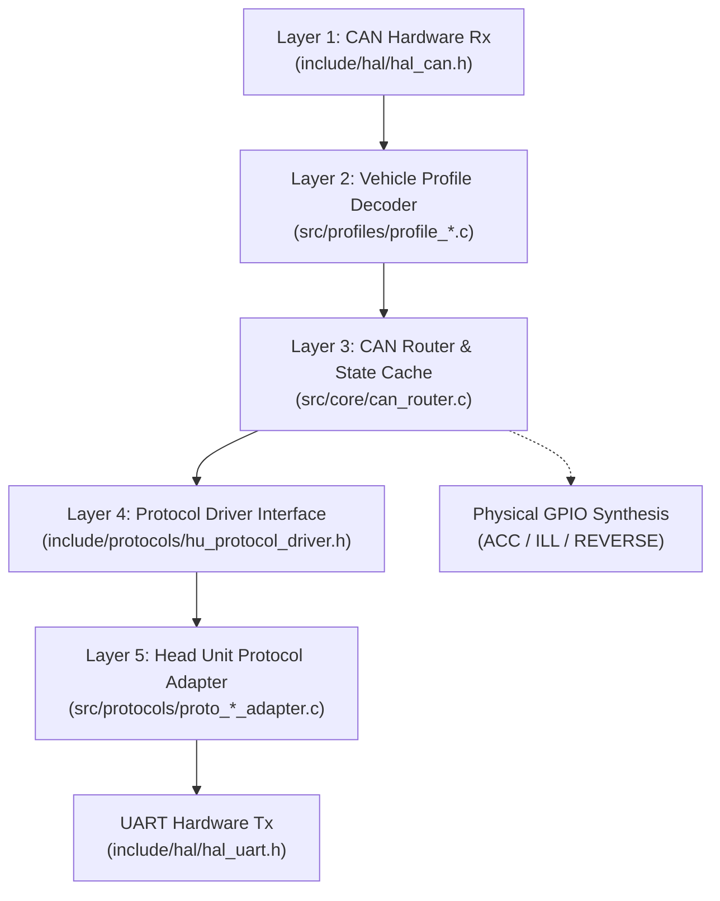

# OpenCanbox Core

Portable, pure C99 firmware for custom CAN bus adapters interfacing vehicle CAN networks with Chinese Android head units (**Hiworld**, **Raise**, **Bagoo**, **Simple Soft**).

Designed to compile without modification across multiple microcontroller architectures (**STM32F103**, **ESP32**, **Arduino/AVR**, **Nuvoton NUC131**) and run natively on **Linux** using SocketCAN and pseudo-terminals (`pty`) for lightning-fast desktop simulation, bench testing, and CI/CD validation.

---

## Architecture Overview

```
+-----------------------------------------------------------------------------+
|                Android Head Unit Protocol Engine (Pure C99)                 |
|  - Dynamic protocol dispatch (Hiworld, Raise, Bagoo)                        |
|  - Bidirectional packet framer, streaming parser, and checksum engines      |
|  - Uplink telemetry serializers & Downlink control command decoders         |
+-----------------------------------------------------------------------------+
                                       ▲
                                       │ (Canonical Vehicle State Structs)
                                       ▼
+-----------------------------------------------------------------------------+
|                     CAN Router & State Cache Engine                         |
|  - Vehicle matrix decoders (Peugeot/PSA CAN2004, VAG, Toyota, etc.)         |
|  - Normalized vehicle state tracking & differential change-detection (delta)|
|  - Rate-limited dispatch tiers preserving 38,400 baud serial bandwidth     |
+-----------------------------------------------------------------------------+
                    │                                      │
                    ▼                                      ▼
+--------------------------------------+ +------------------------------------+
| Hardware Abstraction Layer (HAL API) | |      Hardware GPIO Line Drivers    |
|   hal_can.h  |  hal_uart.h           | | - ACC (12V Switched Wakeup)        |
|   hal_system.h  |  hal_gpio.h        | | - ILL (Nighttime Illumination)     |
+--------------------------------------+ | - REVERSE (Instant Camera Switch)  |
        │                 │              +------------------------------------+
        ▼                 ▼                                │
+---------------+ +---------------+                        │
|  Linux Host   | |   STM32 LL    | ◄──────────────────────┘
| (SocketCAN /  | | (bxCAN /      |
|    pty)       | |  USART / GPIO)|
+---------------+ +---------------+
        │                 │
        ▼                 ▼
+---------------+ +---------------+
|  ESP32 TWAI   | | Nuvoton C_CAN |
| (ESP-IDF /    | | (NuMicro /    |
|  UART / GPIO) | |  UART)        |
+---------------+ +---------------+
```

---

## 5-Layer Processing Pipeline

To guarantee complete vehicle and protocol portability, all features strictly traverse the 5-layer pipeline:



1. **Layer 1: CAN Hardware Rx** — Microcontroller or Linux host CAN driver ingests raw arbitration IDs and payloads into a lock-free SPSC ring buffer.
2. **Layer 2: Vehicle Profile Decoder** — Decodes raw manufacturer-specific bitfields and endianness (`read_be16`, `read_le16`) into a normalized vehicle state structure ([`vehicle_state_t`](include/core/can_router.h)).
3. **Layer 3: CAN Router & State Cache** — Caches current vehicle state and compares it against previous state (`s_last_sent_state`). Dispatches events based on frequency classes to avoid saturating the 38,400 baud serial bus.
4. **Layer 4: Protocol Driver Interface** — Vtable-driven protocol abstraction ([`hu_protocol_driver_t`](include/protocols/hu_protocol_driver.h)) decoupling car profiles from head unit protocols.
5. **Layer 5: Head Unit Protocol Adapter** — Serializes canonical data into target protocol binary frames (Hiworld, Raise, Bagoo) and transmits via HAL UART.
6. **Physical GPIO Line Synthesis** — Decodes real-time CAN messages to drive physical $+12\text{V}$ output circuits (ACC, ILL, REVERSE) for head units lacking CAN-driven wake-up.

---

## Key Features & Supported Telemetry

* **Zero MCU Lock-In:** Core translation and state-machine logic contain no platform-specific headers.
* **Strict C99 & Zero Dynamic Memory Allocation:** Absolutely no `malloc`, `calloc`, or `free`; safe for bare-metal interrupts, deterministic execution, and automotive safety.
* **Lock-Free SPSC Queues:** Power-of-two bitwise-masked ring buffers ([`ring_buffer_t`](include/core/ring_buffer.h)) for non-blocking producer-consumer execution between ISRs and the main loop.
* **Intelligent Bandwidth Throttling:** State-caching delta filter maintaining $> 85\%$ idle margin on 38,400 baud serial links:
  * **Class A (Event-Driven / Immediate, $< 10\text{ ms}$):** Reverse gear, SWC keys, door state changes, climate adjustments, handbrake, emergency TPMS alarms.
  * **Class B (Throttled Dynamic, 5–10 Hz):** Steering wheel angle for trajectory guidelines, vehicle speed, engine RPM.
  * **Class C (Periodic Keepalive, 1 Hz):** Open door status repetition, connection heartbeat, BSI settings sync.
  * **Class D (Infrequent Telemetry, on-change / 30 s):** Numeric tire pressures (bar/psi), ambient temperatures, extended trip metrics.
* **Comprehensive Automotive Telemetry Supported:**
  * **Steering Wheel Controls (SWC):** Volume Up/Down, Seek/Track Next/Prev, Source/Mode, Mute, Rollers, Trip/Menu navigation.
  * **Dual-Zone Climate (HVAC):** Fan speed, driver/passenger setpoint temperatures, blow direction modes (windshield, face, feet), AC, auto, recirculation, defrost, and downlink touchscreen control.
  * **Doors & Body Status:** 4 doors (FL, FR, RL, RR), trunk, hood, handbrake status with immediate change-detection and 1 Hz open-door keepalive repetition.
  * **Trip Computer & Fuel Telemetry:** Instantaneous fuel consumption, historical Trip 1 & Trip 2 (average speed, fuel consumption, distance traversed), cruising range (distance-to-empty), target destination distance, and downlink trip reset command dispatch.
  * **Tire Pressure Monitoring (TPMS):** Independent 4-wheel numeric pressures (bar / psi) and status alarms (nominal, low pressure, puncture).
  * **Parking Radar (AAS):** Front and rear 4-zone obstacle distance sensors and acoustic buzzer warning state.
  * **Steering Angle Sensor (SAS):** Real-time trajectory angle up to 10 Hz for dynamic reverse parking guide lines.
  * **Hardware GPIO Synthesis:** Synthesizes dedicated physical $+12\text{V}$ lines: **REVERSE** (instant camera trigger), **ILL** (headlight/illumination dimming), and **ACC** (switched accessory wake power) for vehicles where factory radio harnesses omit analog triggers.

---

## Supported Protocols & Profiles

### Head Unit Protocols

| Protocol | Sync Framing | Baud Rate | Directionality | Status |
| :--- | :--- | :--- | :--- | :--- |
| **Hiworld** | `0x5A 0xA5` | 38,400 / 115,200 | Bidirectional (Uplink + Downlink) | Full (Handshake `0x24`, Versions `0xF0`, Clima `0x31`/`0x32`, Trip `0x33`/`0x34`/`0x35`, Radar `0x22`/`0x23`/`0x24`, Doors `0x02`/`0x25`, TPMS `0x38`/`0x39`, SAS `0x26`, SWC `0x11`) |
| **Raise** | `0x2E` | 38,400 | Bidirectional | Complete (SWC, Doors, Wheel Angle, Speed/RPM, BSI Settings, Trip Reset) |
| **Bagoo** | `0xFD` / `0xD5` | 38,400 | Bidirectional | Baseline (SWC, Doors, Version query) |
| **Simple Soft** | `0xAA 0x55` | 38,400 | Bidirectional | Planned / Architecture Ready |

### Vehicle Profiles

| Profile ID | Vehicle Model / Generation | Supported Buses | CAN IDs Decoded |
| :--- | :--- | :--- | :--- |
| `VEHICLE_PROFILE_PEUGEOT_407` | Peugeot 407 (2004–2011) | PSA CAN2004 Comfort (125 kbps) / Body | `0x036`, `0x0F6`, `0x128`, `0x0B6`, `0x1E1`, `0x228`, `0x268`, `0x3A1`, `0x348` |
| `VEHICLE_PROFILE_PSA_GENERIC` | Peugeot 307 / 308 / Citroen C4 / C5 | PSA CAN2004 & CAN2010 | Full standard PSA Comfort matrix |
| `VEHICLE_PROFILE_VAG_PQ` | VW Golf 5/6, Passat B6, Octavia 2 | VAG PQ35 / PQ46 (100 / 500 kbps) | Steering wheel, door status, ignition |

---

## Project Structure

```text
canbox-core/
├── platformio.ini                  # Multi-target configuration (Native, STM32, ESP32)
├── Makefile.nuc131                 # Standalone GCC build for Nuvoton NUC131
├── development_guidelines.md       # Engineering standards, frequency tiers, 5-layer rules
├── AGENTS.md                       # AI agent workflow constraints and guidelines
├── doc/                            # Comprehensive protocol, hardware, and reverse engineering specs
│   ├── TODO_PROGRESS.md                           # Implementation progress vs QF Canbus system HU spec
│   ├── HARDWARE_GPIO_REVERSE_ILL_ACC.md           # Dedicated GPIO output driver specification
│   ├── MANUAL_TESTING_WITH_HEADUNIT.md            # Hardware workbench and wiring guide
│   ├── CANBOX_SPEC_HIWORLD_407_01..11_*.md        # Reverse-engineered Hiworld Peugeot specs
│   ├── PEUGEOT_RT4_TRIP_RESET.md                  # Downlink trip computer reset protocol
│   └── PEUGEOT_RT4_CAR_CONFIG.md                  # Car personalization & BSI settings spec
├── include/
│   ├── core/
│   │   ├── can_router.h            # Canonical vehicle state & change-detection engine
│   │   ├── ring_buffer.h           # Lock-free SPSC circular queue
│   │   └── vehicle_profile.h       # Vehicle profile registry & interface
│   ├── hal/
│   │   ├── hal_can.h               # CAN bus driver API
│   │   ├── hal_uart.h              # Serial UART driver API
│   │   ├── hal_gpio.h              # GPIO, LED, ACC/ILL/REVERSE pin API
│   │   └── hal_system.h            # High-resolution monotonic timers & delays
│   ├── profiles/
│   │   └── peugeot_407.h           # Peugeot 407 specific CAN matrix definitions
│   └── protocols/
│       ├── hu_protocol.h           # Public serializer & dispatcher interface
│       ├── hu_protocol_driver.h    # Dynamic protocol vtable
│       ├── canbox_parser.h         # Streaming byte parser
│       ├── proto_hiworld.h         # Hiworld framing & packet serializers
│       ├── proto_raise.h           # Raise framing & packet serializers
│       ├── proto_bagoo.h           # Bagoo framing & packet serializers
│       ├── hiworld_car_mapping.h   # Hiworld model index mappings
│       └── raise_car_mapping.h     # Raise model index mappings
├── src/
│   ├── main.c                      # Main loop for Desktop (Linux) & STM32 targets
│   ├── main_esp32.c                # ESP-IDF FreeRTOS main entry
│   ├── core/                       # can_router, ring_buffer, vehicle_profile
│   ├── profiles/                   # Peugeot 407, Generic PSA, VAG profile implementations
│   ├── protocols/                  # Protocol parsers and adapters (Raise, Hiworld, Bagoo)
│   └── hal/
│       ├── hal_native/             # Linux SocketCAN & POSIX pty drivers
│       ├── hal_stm32/              # STM32F103 LL bxCAN & USART1 drivers
│       └── hal_esp32/              # ESP32 TWAI & UART drivers
├── test/
│   ├── test_protocol_parser/       # Unit tests (protocol framing, checksums, profile decoders)
│   └── test_integration/           # End-to-end integration tests & recorded CAN scenario tests
├── test_data/                      # Real vehicle CAN bus dumps for offline scenario tests
└── tools/                          # Bench testing and verification toolchain
    ├── canbox_e2e_logger.py        # Live bidirectional logger and protocol validator
    ├── canbox_bench_e2e.py         # Automated CAN-to-UART bench scenario runner
    ├── diff_canbox_frames.py       # Differential CAN and serial packet comparison
    ├── canbox_manual_test.py       # Interactive terminal frame injector
    └── replay_serial.py            # Serial packet replayer
```

---

## Getting Started: Linux Desktop Simulation

You can compile, run, and test the entire stack on Linux without any hardware connected.

### 1. Prerequisites

Install CAN utilities and PlatformIO Core:

```bash
sudo apt update
sudo apt install can-utils build-essential picocom
pip install platformio
```

### 2. Configure Virtual CAN & Start Simulation

Create a virtual CAN interface (`vcan0`):

```bash
sudo modprobe vcan
sudo ip link add dev vcan0 type vcan
sudo ip link set up vcan0
```

Start the interactive simulation binary:

```bash
CANBOX_CAN_IFACE="vcan0" pio run -e native_test -t exec
```

Output:

```text
[SYS] Linux monotonic clock initialized.
[CAN] Initialized on vcan0
[UART] Head unit UART simulated on: /dev/pts/3
[UART] Access port symlink available at: /tmp/ttyCanbox
```

### 3. Interactive Testing

Open two additional terminals:

**Terminal 2 — Head Unit UART Monitor:**

```bash
# Monitor raw bytes from the simulated Android Head Unit port
xxd -c 16 < /tmp/ttyCanbox
```

**Terminal 3 — Inject Vehicle CAN Frames:**

```bash
# Steering Wheel Volume Up press (Peugeot 407, CAN ID 0x128)
cansend vcan0 128#0100

# Door status: Driver door open + Handbrake engaged (CAN ID 0x036)
cansend vcan0 036#0100000000000000

# Reverse gear engaged (CAN ID 0x0F6)
cansend vcan0 0F6#0000000000000080
```

---

## Python Bench Tools & Automated E2E Testing

The [`tools/`](tools/) directory contains specialized Python utilities for bench testing with real head units or simulated desktop targets:

### Live E2E Protocol Logger (`canbox_e2e_logger.py`)

Listens to both the CAN bus (`vcan0` or `can0`) and the serial UART port (`/tmp/ttyCanbox` or `/dev/ttyUSB0`), formats decoded packets in real time, and writes timestamped session logs:

```bash
# Run against local desktop simulation
python3 tools/canbox_e2e_logger.py --can vcan0 --serial /tmp/ttyCanbox

# Run against hardware workbench at 38,400 baud
python3 tools/canbox_e2e_logger.py --can can0 --serial /dev/ttyUSB0 --baud 38400
```

### Automated Bench Test Suite (`canbox_bench_e2e.py`)

Injects predefined sequences of CAN frames and verifies that the correct protocol bytes are emitted on UART:

```bash
python3 tools/canbox_bench_e2e.py --can vcan0 --serial /tmp/ttyCanbox
```

---

## Running Automated Tests

All unit and integration tests compile and run natively on Linux using the Unity test framework:

```bash
# Run protocol parser, checksum, and profile decoder unit tests
pio test -e native_test_runner

# Run end-to-end multi-driver CAN-to-UART integration and CAN capture scenario tests
pio test -e integration_test
```

### Building Embedded Targets

Verify that embedded microcontroller firmware targets compile cleanly with zero warnings or errors:

```bash
# Build STM32F103 target (STM32Cube LL framework)
pio run -e stm32_cbox

# Build ESP32 target (ESP-IDF framework)
pio run -e esp32_cbox
```

---

## Target Build Matrix

| Platform | Environment | Hardware Controller | HAL Drivers | Build Command |
| :--- | :--- | :--- | :--- | :--- |
| **Linux Host** | `native_test` | SocketCAN (`vcan0`) + POSIX `pty` | `hal_native` | `pio run -e native_test` |
| **STM32** | `stm32_cbox` | STM32F103 (bxCAN + USART1 + GPIOs) | `hal_stm32` | `pio run -e stm32_cbox` |
| **ESP32** | `esp32_cbox` | ESP32-WROOM-32 (TWAI + UART1 + GPIOs) | `hal_esp32` | `pio run -e esp32_cbox` |
| **Arduino AVR** | `avr_cbox` | ATmega328P + MCP2515 SPI CAN | `hal_avr` | `pio run -e avr_cbox` |
| **Nuvoton NUC131**| Standalone Makefile | Bosch C_CAN + UART0 | `hal_nuc131` | `make -f Makefile.nuc131` |

---

## Adding a New Vehicle Profile

Follow the 5-Layer workflow documented in [development_guidelines.md](development_guidelines.md):

1. **Create Profile Header and Decoder:** Add `include/profiles/<vehicle>.h` and `src/profiles/profile_<vehicle>.c`.
2. **Define CAN Matrix Rules:** Map arbitration IDs and bitfields into [`vehicle_state_t`](include/core/can_router.h):
   ```c
   static void decode_speed(const can_frame_t *frame, vehicle_state_t *state) {
       if (frame->dlc < 4) return;
       state->speed_kmh = (uint16_t)((read_be16(&frame->data[2])) / 100);
   }

   static const profile_can_rule_t s_rules[] = {
       { 0x348, decode_speed }
   };
   ```
3. **Register Profile:** Add profile enum in `include/core/vehicle_profile.h` and register in `src/core/vehicle_profile_manager.c`.
4. **Wire Model IDs:** Map the head unit car selection indexes in `src/protocols/hiworld_car_mapping.c` and `src/protocols/raise_car_mapping.c`.
5. **Verify with Tests:** Add unit tests in `test/test_protocol_parser/` and integration tests in `test/test_integration/`.

---

## License

OpenCanbox Core is released under the MIT / Apache 2.0 open-source license.
