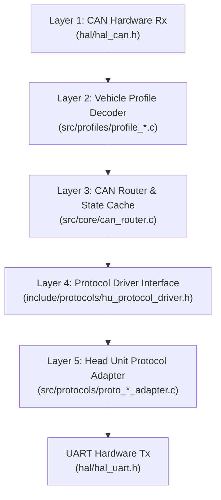

# OpenCanbox Core: Development & Communication Guidelines

This document specifies the architecture, engineering constraints, timing standards, and unification patterns for developing and integrating features into `canbox-core`.

---

## 1. Core Architecture Principles

1. **State-Caching & Change-Filtering Bridge:**
   - Vehicle CAN buses broadcast frames continuously at high cyclic frequencies (typically 10–100 Hz per CAN ID).
   - The Head Unit serial interface operates at a relatively low baud rate (typically **38,400 baud**, yielding a maximum theoretical throughput of ~3,840 bytes/sec).
   - Directly relaying raw or repetitive CAN frames will instantly saturate the serial bus and overflow UART buffers.
   - The firmware MUST act as a state cache: decoding raw CAN frames into an abstract vehicle state, comparing against previous states, and dispatching UART packets according to the frequency standards below.

2. **Zero Heap & Non-Blocking Execution:**
   - Compliant with pure C99 (`-std=c99 -Wall -Wextra -Werror`).
   - Zero dynamic memory allocation (`malloc`, `calloc`, `free` are strictly prohibited).
   - Handlers must be non-blocking with execution times deterministic and minimized.

---

## 2. Dispatch Frequency Standards

Messages dispatched from `canbox-core` to the Head Unit fall into four distinct frequency classes:

| Class | Trigger / Frequency | Latency Requirement | Examples |
| :--- | :--- | :--- | :--- |
| **Class A: Edge-Triggered (Event-Driven)** | Immediate on state delta (zero delay) | $< 10\text{ ms}$ | Reverse gear, SWC keys, Door latch changes, Climate adjustments, Ignition, Handbrake, Emergency TPMS alarms |
| **Class B: Dynamic Telemetry (Throttled)** | Rate-limited on delta (5–10 Hz / 100–200 ms) | $< 100\text{ ms}$ | Steering wheel angle (for dynamic parking lines), Vehicle speed, Engine RPM |
| **Class C: Slow Periodic (Keepalive & Refresh)** | Fixed periodic rate (1–2 Hz / 500–1000 ms) | N/A (Heartbeat / Sync) | Comms heartbeat, Open door status repetition, BSI configuration query |
| **Class D: Infrequent Telemetry** | On delta + slow refresh (10–30 s) | N/A | TPMS tire pressures, Ambient temperatures, Extended trip data |

---

## 3. Detailed Specification by Message Type

### 3.1 Steering Wheel Controls (SWC)
- **Class:** A (Edge-Triggered)
- **Dispatch Rule:**
  - Sent immediately when a key press is detected (`press_state = 1`).
  - Sent immediately when the key is released (`press_state = 0` / key code `0x00`).
  - **NEVER** transmit periodic packets while keys are idle / unpressed (`press_state == 0` and no key transition).
- **Target Latency:** Immediate ($< 10\text{ ms}$).

### 3.2 Reverse Gear & Camera Trigger
- **Class:** A (Edge-Triggered)
- **Dispatch Rule:**
  - Transmitted **only once** upon state transition (Engaged $\leftrightarrow$ Disengaged).
  - Must NOT be sent continuously or cyclically.
- **Target Latency:** Critical ($< 10\text{ ms}$) to ensure instant rear camera activation on the Android HU.

### 3.3 Doors, Trunk, and Hood Status
- **Class:** A (Edge-Triggered) + Class C (Slow Refresh)
- **Dispatch Rule:**
  - Immediate packet dispatched upon any state transition (any door opened or closed).
  - While **any** door/trunk/hood remains open, repeat the door status frame at a rate of **1 Hz (every 1000 ms)** as a safety keepalive.
  - When all doors are closed, cease periodic repetitions immediately.
  - *Anti-Pattern:* Do NOT repeat door packets at 10 Hz (every 100 ms); this wastes bus capacity.

### 3.4 Climate Control (HVAC)
- **Class:** A (Edge-Triggered)
- **Dispatch Rule:**
  - Immediate packet dispatched when any user input or HVAC status changes (temperature knob, fan speed, air distribution, AC/defrost toggle).
  - Idle cyclic HVAC CAN frames must be absorbed by the cache without triggering UART transmission.
- **Target Latency:** $< 20\text{ ms}$ for responsive on-screen HVAC overlay display.

### 3.5 Dynamic Telemetry (Steering Angle, Speed, RPM)
- **Class:** B (Throttled Dynamic)
- **Dispatch Rule:**
  - Evaluated in the periodic task (nominally 100 ms).
  - **Steering Angle:** Dispatched at up to **10 Hz (100 ms)** when angle changes, ensuring smooth trajectory guideline movement in reverse camera mode.
  - **Vehicle Speed & RPM:** Throttled to **2–5 Hz (200–500 ms)** with a deadband threshold ($\Delta \text{Speed} \ge 1\text{ km/h}$, $\Delta \text{RPM} \ge 50\text{ RPM}$) to suppress unnecessary traffic while cruising at steady state.

### 3.6 TPMS (Tire Pressure Monitoring)
- **Class:** A (Alarms) / Class D (Numeric Pressures)
- **Dispatch Rule:**
  - **Puncture / Low-Pressure Alarms:** Dispatched immediately upon detection (Class A).
  - **Numeric Pressures (bar / psi):** Dispatched when pressure value changes, plus a slow background refresh every **30 seconds** (Class D).

### 3.7 Power, Ignition & Handbrake
- **Class:** A (Edge-Triggered)
- **Dispatch Rule:**
  - Sent immediately when ignition state (OFF / ACC / ON / CRANK) or handbrake status changes.
  - Used by HU power management and video-in-motion safety lockouts.

### 3.8 Heartbeat / Protocol Keepalive
- **Class:** C (Slow Periodic)
- **Dispatch Rule:**
  - Dispatched at **1 Hz (1000 ms)** (or 2 Hz / 500 ms if explicitly required by a specific protocol adapter).
  - *Anti-Pattern:* Unconditional 10 Hz (100 ms) heartbeat flooding is strictly prohibited as it consumes ~10% of total UART airtime.

---

## 4. UART Bandwidth Budget (38,400 Baud)

- **Raw Baud Rate:** 38,400 bits/sec
- **Effective Byte Throughput (8N1):** ~3,840 bytes/sec $\approx$ 384 bytes per 100 ms tick.
- **Typical Packet Overhead:** 5 to 16 bytes per frame (including framing, length, CMD, payload, and checksum).
- **Packet Transmission Time:** ~1.3 ms to ~4.2 ms per frame.

### Bandwidth Allocation Model:
```text
Total Bandwidth: 3,840 bytes/s (100%)
├── Static Keepalives & Heartbeats:   ~15 - 30 bytes/s   (< 1%)   [1 Hz]
├── Active Dynamic Telemetry:         ~80 - 160 bytes/s  (~2 - 4%) [5 - 10 Hz]
├── Event Bursts (Doors/SWC/HVAC):    ~50 - 150 bytes/s  (~1 - 4%) [Transient]
└── Available Headroom / Margin:      > 3,400 bytes/s    (> 90%)
```
Maintaining $> 85\%$ idle bandwidth margin ensures that simultaneous burst events (e.g. rapid steering angle turns while pressing a volume button and toggling AC) will never cause TX buffer congestion or dropped frames.

---

## 5. Summary Timing Matrix

| Signal Group | CAN Ingest Frequency | Serial Dispatch Frequency | Trigger Condition |
| :--- | :--- | :--- | :--- |
| **SWC Button** | 10–50 Hz | Immediate (0–10 ms) | On press / On release |
| **Reverse Gear** | 10–50 Hz | Immediate (0–10 ms) | On state change only |
| **Ignition / ACC** | 10–50 Hz | Immediate (0–10 ms) | On state change only |
| **Handbrake** | 10–50 Hz | Immediate (0–10 ms) | On state change only |
| **Door Latches** | 10–50 Hz | Immediate + 1 Hz repeat | On change; repeat while open |
| **Climate (HVAC)** | 10–20 Hz | Immediate (0–20 ms) | On user adjustment / change |
| **Steering Angle** | 50–100 Hz | Max 10 Hz (100 ms) | Throttled, on value change |
| **Speed & RPM** | 50–100 Hz | Max 2–5 Hz (200–500 ms) | Throttled with deadband |
| **TPMS Values** | 1–10 Hz | On change + 30 s refresh | On change or 30 s timeout |
| **Heartbeat** | N/A (Internal) | 1 Hz (1000 ms) | Periodic timer |

---

## 6. General Rules for Creating New Functionality

Every new automotive feature integrated into `canbox-core` must traverse the **5-Layer Pipeline**. Never skip layers or tightly couple vehicle CAN IDs to Head Unit protocol packets.



> [!CAUTION]
> **The "Silent UART / No Data After Implementation" Anti-Pattern:**
> Writing a CAN parser or byte builder in `src/profiles/` (e.g. `peugeot_407.c`) along with passing isolated unit tests **DOES NOT** deliver a feature. If the CAN ID is omitted from `profile_*.c:s_*_rules[]`, or omitted from `can_router.c` state routing, or omitted from `proto_*_adapter.c`, the firmware will silently drop the incoming CAN frames and transmit **zero UART bytes** on the vehicle bench. All 5 layers are strictly mandatory before marking any feature done.

### Mandatory 5-Layer Implementation Checklist

Before declaring any feature complete, verify that every layer in the chain has been implemented:

- [ ] **Layer 1 & 2: Vehicle Profile Registration & Parsing (`src/profiles/`)**
  - CAN arbitration IDs registered in the profile's rule table `s_<profile>_rules[]` in `src/profiles/profile_<car>.c`.
  - Boundary and DLC validated: `if (frame->dlc < EXPECTED_LEN) return;`.
  - Data unpacked using endian helpers (`read_be16`, `read_le16`).
  - Output written directly to `state->your_feature`.
- [ ] **Layer 3: Canonical State Modeling & Delta Routing (`include/core/can_router.h` & `src/core/can_router.c`)**
  - Canonical feature struct `vehicle_<feature>_t` defined in `can_router.h` and embedded in `vehicle_state_t`.
  - Change-detection / delta gating implemented in `can_router_process_can()` (event-driven Class A) or `can_router_periodic_100ms()` (throttled/periodic Class B/C/D).
  - Router calls `hu_protocol_send_<feature>()` and updates `s_last_sent_state`.
- [ ] **Layer 4: Protocol Driver Abstraction (`include/protocols/hu_protocol_driver.h` & `hu_protocol.h`)**
  - Function pointer `void (*send_<feature>)(...)` added to `hu_protocol_driver_t`.
  - Public dispatcher `hu_protocol_send_<feature>()` declared in `hu_protocol.h` and implemented in `src/protocols/hu_protocol.c`.
  - All existing protocol drivers (`proto_raise_adapter.c`, `proto_hiworld_adapter.c`, `proto_bagoo_adapter.c`) updated (set to `NULL` if unsupported).
- [ ] **Layer 5: Head Unit Protocol Serialization & UART Tx (`src/protocols/proto_*_adapter.c`)**
  - Target adapter translates canonical struct into wire payload and invokes `proto_<protocol>_serialize()`.
  - Serialized packet transmitted via `hal_uart_write(tx_buf, len)`.
- [ ] **End-to-End Integration Verification (`test/test_integration/`)**
  - An integration test in `test/test_integration/` feeds a raw `can_frame_t` through `can_router_process_can()` and asserts the exact expected UART byte sequence on `read_uart_output()`.

---

### Step 1: Model Domain Data in Canonical State (`include/core/can_router.h`)
- Create or update the normalized, hardware-independent C structure representing the feature (e.g. `vehicle_doors_t`, `vehicle_climate_t`, `vehicle_tpms_t`, `vehicle_trip_t`, `vehicle_gear_t`).
- Embed this struct into the master vehicle state structure [`vehicle_state_t`](file:///home/Fazer/git/canbox-core/include/core/can_router.h#L90-L125).
- Use canonical engineering units (e.g. 0.1 Bar for TPMS, 0.1 L/100km for fuel, degrees for steering angle, km/h for speed, bool for discrete states).

### Step 2: Implement Vehicle Profile Decoder (`src/profiles/`)
- In the vehicle profile (e.g. `profile_psa.c`), register the CAN arbitration ID in the profile's rule table `can_router_rule_t`.
- Unpack CAN frame payload into canonical values:
  - **Always check boundary:** `if (frame->dlc < EXPECTED_LEN) return;`
  - **Always use endian helpers:** `read_be16()`, `read_le16()`, `read_be32()`. Never cast `(uint16_t *)&frame->data[x]`.
  - **Filter uninitialized / masking flags:** Guard against invalid/masked signals (e.g. BSI masking bits or `0xFFFF` values) before writing to state.
- Update `state->your_feature`.
- **Zero protocol knowledge:** The profile must have NO knowledge of Raise, Hiworld, or Bagoo UART protocol commands.

### Step 3: Implement Delta Routing & Frequency Throttling (`src/core/can_router.c`)
- Add change detection comparing `s_current_state.your_feature` with `s_last_sent_state.your_feature`.
- Decide dispatch class:
  - **Class A (Event):** Place check inside [`can_router_process_can()`](file:///home/Fazer/git/canbox-core/src/core/can_router.c#L20). If changed, call `hu_protocol_send_your_feature(&s_current_state.your_feature)` and update `s_last_sent_state.your_feature`.
  - **Class B/C/D (Throttled/Periodic):** Place check inside [`can_router_periodic_100ms()`](file:///home/Fazer/git/canbox-core/src/core/can_router.c#L78) with appropriate tick prescaler and deadbands.

### Step 4: Declare Driver Interface & Implement Protocol Adapters
1. Add function pointer to [`hu_protocol_driver_t`](file:///home/Fazer/git/canbox-core/include/protocols/hu_protocol_driver.h#L20-L36):
   ```c
   void (*send_your_feature)(const vehicle_your_feature_t *data);
   ```
2. Add public dispatcher to [`hu_protocol.h`](file:///home/Fazer/git/canbox-core/include/protocols/hu_protocol.h) and [`hu_protocol.c`](file:///home/Fazer/git/canbox-core/src/protocols/hu_protocol.c):
   ```c
   void hu_protocol_send_your_feature(const vehicle_your_feature_t *data) {
       if (s_active_driver && s_active_driver->send_your_feature) {
           s_active_driver->send_your_feature(data);
       }
   }
   ```
3. Implement translation in active protocol adapters (`proto_raise_adapter.c`, `proto_hiworld_adapter.c`, `proto_bagoo_adapter.c`):
   - Translate canonical struct into protocol CMD wire bytes using `proto_<name>_serialize()`.
   - Transmit via `hal_uart_write(tx_buf, len)`.
   - Explicitly initialize unsupported adapters to `NULL`.

### Step 5: Unit & Integration Verification (`test/`)
- Add unit test verifying that `proto_<name>_serialize()` builds the exact byte stream expected by the Head Unit.
- Add integration test in `test/test_integration/` verifying that feeding a raw CAN frame into `can_router_process_can()` emits the correct UART packet.
- Add delta suppression test: re-feeding identical CAN frame must generate zero UART bytes.
- When working from a real capture log (`dump_*.log`), verify the fix against the real CAN frames in that log.

---

## 7. Design Patterns to Follow

### Pattern 1: Canonical State Decoupling
Vehicle profiles and HU protocols must NEVER talk directly. The `vehicle_state_t` structure acts as a strict firewall:
```text
[CAN Frame] -> [Profile Decoder] -> [vehicle_state_t] -> [Router Delta] -> [HU Adapter] -> [UART Wire]
```
This guarantees that adding a new vehicle (e.g. Toyota TNGA) automatically works with all Head Unit protocols (Raise, Hiworld, Bagoo), and adding a new HU protocol automatically supports all vehicles.

### Pattern 2: Differential Change Detection (Delta Gating)
Never emit serial packets without delta verification:
- **Compound structs:** Use `memcmp()` against `s_last_sent_state`:
  ```c
  if (memcmp(&s_current_state.doors, &s_last_sent_state.doors, sizeof(vehicle_doors_t)) != 0) {
      hu_protocol_send_doors(&s_current_state.doors);
      s_last_sent_state.doors = s_current_state.doors;
  }
  ```
- **Scalar values with deadband:** For continuously drifting analog signals (speed, RPM):
  ```c
  if (abs((int)s_current_state.speed_kmh - (int)s_last_sent_state.speed_kmh) >= 1) { ... }
  ```

### Pattern 3: Subdomain Decoupling
When a feature contains both high-frequency or discrete alarm components and slower numeric components, decouple them so that one does not trigger redundant transmissions of the other.
- **Reference:** TPMS implementation in `can_router.c` separates `pressures_changed` from `alarms_changed`. If only tire pressure changed, only `hu_protocol_send_tpms_numeric()` is sent; discrete alarm frames are suppressed.

### Pattern 4: Prescaled Periodic Ticks
`can_router_periodic_100ms()` executes at 10 Hz (every 100 ms). Use static tick counters to derive lower-frequency standard clocks:
```c
static uint8_t s_1s_prescaler = 0;
if (++s_1s_prescaler >= 10) {
    s_1s_prescaler = 0;
    // 1 Hz Periodic tasks (Heartbeat, Open Door keepalive)
}
```

### Pattern 5: Optional Capability Handling (`NULL` Fallback)
Protocol adapters vary in supported feature sets. All driver function pointers are optional:
- Adapters set unsupported feature pointers to `NULL`.
- The router layer calls the dispatcher unconditionally.
- The dispatcher checks `if (driver && driver->send_feature)` before invoking. No crashing, no stub boilerplate needed.

---

## 8. Important Engineering Constraints

1. **Pure C99 Only:**
   - All code in `src/core/`, `src/protocols/`, `src/profiles/` must compile under `-std=c99 -Wall -Wextra -Werror`.
   - Variable declarations at beginning of blocks or standard C99 scope.
2. **Zero Dynamic Memory Allocation:**
   - Calls to `malloc()`, `calloc()`, `free()`, `realloc()` are strictly forbidden.
   - All state, ring buffers, and scratch serialization buffers must be static or stack-allocated with fixed maximum capacities.
3. **Zero MCU Leakage:**
   - Never `#include <Arduino.h>`, `<stm32f1xx.h>`, `<driver/twai.h>`, or `<freertos/...>` in core/protocol/profile code.
   - All hardware access must route strictly through `include/hal/*.h`.
4. **Lock-Free Single-Producer Single-Consumer (SPSC) Ring Buffers:**
   - All producer-consumer queues must use power-of-two capacities and bitwise masking (`ring_buffer_t`). No mutexes, semaphores, or RTOS primitives in core code.
5. **Deterministic Non-Blocking Loops:**
   - Never write unbounded polling loops (`while (!flag);`).
6. **Endian & Alignment Safety:**
   - Never cast raw CAN/UART byte pointers to multi-byte structs or integer pointers (causes alignment faults on ARM Cortex-M0/M3).
   - Use `read_be16`, `read_le16`, `write_be16`, `write_le16` helpers.
7. **Boundary & DLC Validation:**
   - Always verify `frame->dlc` prior to reading array elements from `frame->data[]`.

---

## 9. Current Implementation Verification & Gap Audit

An audit of our current implementation against these guidelines reveals the following status:

| Feature / Domain | Profile Decoding | Core State & Delta | HU Driver Interface | Adapter Implementations | Compliance Status & Action Required |
| :--- | :--- | :--- | :--- | :--- | :--- |
| **Steering Wheel Keys (SWC)** | `profile_psa.c`<br>`peugeot_407.c` | Immediate delta on key & press state in `can_router.c` | `send_wheel_key` | Raise: ✅<br>Hiworld: ✅<br>Bagoo: ✅ | **Fully Compliant** (Class A). Sends press and release. |
| **Doors & Latches** | `profile_psa.c`<br>`peugeot_407.c` | Immediate delta via `memcmp` + 1 Hz periodic repeat while open | `send_doors` | Raise: ✅<br>Hiworld: ✅<br>Bagoo: ✅ | **Fully Compliant** (Class A immediate on delta + Class C 1 Hz safety refresh while open). |
| **Climate (HVAC)** | `profile_psa.c`<br>`peugeot_407.c` | Immediate delta via `memcmp` in `can_router.c` | `send_climate` | Raise: ❌ (NULL)<br>Hiworld: ✅<br>Bagoo: ❌ (NULL) | **Compliant Timing** (Class A). Raise and Bagoo need adapter implementation for HVAC popups. |
| **TPMS** | `profile_psa.c`<br>`peugeot_407.c` | Decoupled numeric vs discrete delta + 30s refresh | `send_tpms`<br>`send_tpms_numeric`<br>`send_tpms_discrete` | Raise: ❌ (NULL)<br>Hiworld: ✅<br>Bagoo: ❌ (NULL) | **Fully Compliant** (Class A alarms + Class D numeric). Raise and Bagoo adapters need implementation. |
| **Trip Computer & Fuel Economy** | `profile_psa.c`<br>`peugeot_407.c` (0x221, 0x2A1, 0x261) | Immediate delta on `updated_page` in `can_router.c` | `send_trip_instant`<br>`send_trip1`<br>`send_trip2` | Raise: ❌ (NULL)<br>Hiworld: ✅ (Cmds 0x13, 0x14, 0x15)<br>Bagoo: ❌ (NULL) | **Fully Compliant** (Class A / immediate on new valid frame). |
| **Dynamic Telemetry** | `profile_psa.c` (speed, rpm, angle) | 100 ms periodic check on delta in `can_router.c` | `send_telemetry` | Raise: ✅ (speed, rpm, angle)<br>Hiworld: ⚠️ (angle only)<br>Bagoo: ⚠️ (angle only) | **Partially Compliant:** 100 ms steering angle is optimal for dynamic lines. Speed/RPM need deadband threshold to avoid firing every tick during small speed fluctuations. |
| **Reverse Gear** | `profile_psa.c`<br>`profile_vag.c` | ❌ **Missing** in `can_router.c` | ❌ **Missing** in `hu_protocol_driver.h` | ❌ **Missing** | ⚠️ **Critical Gap:** Reverse flag is parsed into `state->reverse_gear`, but never routed or dispatched to HU. Camera switching cannot function. |
| **Power / Ignition** | `profile_psa.c` | ❌ **Missing** in `can_router.c` | ❌ **Missing** in `hu_protocol_driver.h` | ❌ **Missing** | ⚠️ **Critical Gap:** Ignition state is parsed into `state->ignition_state`, but never dispatched to HU. |
| **Handbrake** | `profile_psa.c`<br>`profile_vag.c` | ❌ **Missing** in `can_router.c` | ❌ **Missing** in `hu_protocol_driver.h` | ❌ **Missing** | ⚠️ **Gap:** Handbrake state parsed into `state->handbrake`, but never routed. |
| **Lights** | `profile_psa.c` | ❌ **Missing** in `can_router.c` | ❌ **Missing** in `hu_protocol_driver.h` | ❌ **Missing** | ⚠️ **Gap:** Headlight/fog state parsed into `state->lights`, but never routed. |
| **Heartbeat / Keepalive** | Internal | Called unconditionally every 100 ms in `can_router.c` | `send_heartbeat` | Raise: ✅<br>Hiworld: ✅<br>Bagoo: ✅ | ⚠️ **Timing Discrepancy:** Heartbeat is dispatched at **10 Hz (every 100 ms)** instead of the standard **1 Hz (1000 ms)**. Consumes ~10% continuous UART bandwidth. |

---

## 10. Build, Test & Workspace Integrity Protocol (Zero-Defect Standard)

To prevent build breakages and silent runtime regressions, every code modification must pass the following quality gates prior to completion.

### 10.1 Multi-Target Compilation Gate
Never run only a single environment (e.g. `-e native_test_runner`) and assume all targets compile. A change in a shared header may build under unit tests but break integration tests, desktop simulation, or MCU targets.

**Mandatory Verification Sequence:**
```bash
# 1. Run all test environments (unit tests + integration tests)
~/.platformio/penv/bin/pio test

# 2. Build STM32 bare-metal firmware
~/.platformio/penv/bin/pio run -e stm32_cbox

# 3. Build ESP32 ESP-IDF firmware
~/.platformio/penv/bin/pio run -e esp32_cbox
```
All commands must exit with code `0`. Any compilation error, warning under `-Werror`, or linker error is an immediate blocker.

### 10.2 Header Dependency & Single-Source-of-Truth Gate
- **Canonical Model Declaration:** All shared data models (`vehicle_<feature>_t`) MUST be declared in [`include/core/can_router.h`](file:///home/Fazer/git/canbox-core/include/core/can_router.h) and embedded in `vehicle_state_t` before any driver or adapter header references them.
- **Header Self-Containment:** Every header must be able to compile independently. Avoid forward-declaration assumptions or circular header dependencies.
- **Synchronized Driver Interfaces:** Whenever adding a callback to [`hu_protocol_driver_t`](file:///home/Fazer/git/canbox-core/include/protocols/hu_protocol_driver.h):
  1. Add the function pointer to `hu_protocol_driver_t`.
  2. Add the public wrapper to `include/protocols/hu_protocol.h` and `src/protocols/hu_protocol.c`.
  3. Update **ALL** protocol driver structs (`g_hu_protocol_raise`, `g_hu_protocol_hiworld`, `g_hu_protocol_bagoo`). Unused/unimplemented drivers must be explicitly assigned `= NULL`.

### 10.3 Working Tree & State Sync Gate (`git status` Check)
Before concluding any task, perform an inspection of the git working copy:
```bash
git status -s
```
- Ensure that no modified header (such as `include/core/can_router.h`) was inadvertently reverted, discarded, or omitted from the working tree.
- Confirm that every modified file compiles cleanly in unison, not relying on cached object files or half-applied patches.

### 10.4 Bench Log & Scenario Verification Gate (No Silent Failures)
When addressing an issue reported from a real vehicle capture dump (`dump_*.log`):
1. **Locate Ground Truth:** Identify the exact CAN IDs and raw data payloads in the dump (e.g. using `grep` or `python3 tools/diff_canbox_frames.py`).
2. **Trace the Pipeline:** Confirm that the active profile rules (`s_<profile>_rules[]`) include every relevant CAN ID.
3. **Automate the Vector:** Write an automated test in `test/test_integration/` that feeds the exact payload from the log through `can_router_process_can()` and asserts the expected UART output.
4. **Guard Against Masking:** Verify that invalid or uninitialized frames (e.g. BSI masking bytes or `0xFFFF` uncalibrated readings) do not produce spurious UART traffic.
