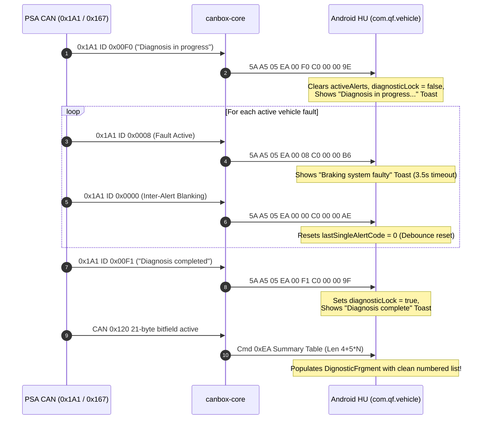

# Hiworld (WC / 0x5AA5) Vehicle Alerts & Diagnostic Journal Specification
## Master Catalog: Peugeot 407 Warning Architecture, Real-Time Popups, ISO-TP Alert Journal & Android UI Integration

**Document File:** `CANBOX_SPEC_HIWORLD_407_12_ALERTS_DIAGNOSTICS.md`  
**Document Version:** 1.0.0  
**Target Platform:** Automotive Android Infotainment SoC $\longleftrightarrow$ Pure C99 CAN Box Firmware  
**Vehicle Network:** Peugeot 407 & PSA Platform (CAN 2004 / PSA 15 Comfort & Body CAN @ 125 kbps)  
**Primary Driver Protocol:** Hiworld (`0x5A 0xA5` Framing, Additive Checksum)  
**Command Identifiers:** `0x42` (`HIWORLD_CMD_WARNING_INFO`), `0x2F` (`HIWORLD_CMD_DIAGNOSTIC_QUERY`)  
**Standard Reference:** Decompiled Android Automotive Core (`com.qf.vehicle.band.peugeot.parse.wc.PeugeotDataParser`, `PeugeotDataController`, `DignosticFrgment`) & RT4 Magneti Marelli Firmware SW 8.31

---

# Table of Contents
1. [Overview & Architectural Context](#1-overview--architectural-context)
2. [Vehicle CAN Transport Protocols](#2-vehicle-can-transport-protocols)
   - 2.1 Primary Immediate Alert Frame: `0x1A1` (`MSG_BSI_CDE_PTR_MESSAGE`)
   - 2.2 Historical Alert Journal Transport: `0x120` (`MSG_JOURNAL_ALERTES`)
3. [Hiworld 5AA5 Serial Protocol Serialization](#3-hiworld-5aa5-serial-protocol-serialization)
   - 3.1 Format A: Multi-Alert Summary (`Len = 0x18`)
   - 3.2 Format B: Single Real-Time Alert (`Len = 0x02`)
4. [Master Signal & Alert ID Mapping Table](#4-master-signal--alert-id-mapping-table)
5. [Pure C99 Implementation Reference](#5-pure-c99-implementation-reference)
   - 5.1 Canonical Vehicle State (`include/core/can_router.h`)
   - 5.2 CAN Profile Decoder (`src/profiles/peugeot_407.c`)
   - 5.3 Protocol Driver Interface & Adapter (`src/protocols/proto_hiworld_adapter.c`)
6. [Desktop Test Harness & Verification Vectors](#6-desktop-test-harness--verification-vectors)

---

# 1. Overview & Architectural Context

In Peugeot 407 vehicles equipped with factory infotainment (RD4, RT3, RT4, RT5), health and safety warnings originate from the **Body Systems Interface (BSI)** and dedicated vehicle ECUs (ABS/ESP, Airbag, TPMS, Engine Management). The system supports two distinct presentation modes:

1. **Immediate Modal Alerts:** When a fault or safety alert triggers while driving (e.g. low fuel, puncture, door opened in motion, engine overheat), the BSI broadcasts high-priority frame `0x1A1`. The Head Unit displays a modal dialog or floating toast (`WindowTextWarning`) accompanied by an acoustic chime.
2. **Persistent Alert Log (Journal des Alertes):** Drivers browse the **Alert Log** via the `Vehicle Diagnostics` -> `Diagnostic Information` UI menu (`DignosticFrgment`). The BSI transfers the complete active fault table over segmented CAN frames on `0x120`.

```
+------------------------------------------------------------------------------------+
|                         Peugeot 407 Vehicle Network (125 kbps)                     |
|           [BSI Module (0x1A1 / 0x120) | ABS ECU (0x0E6) | Airbag (0x269)]          |
+------------------------------------------------------------------------------------+
                                         │
                                         ▼ (CAN Confort)
+------------------------------------------------------------------------------------+
|                         OpenCanbox Core (Pure C99 Microcontroller)                 |
|   1. L1 HAL: hal_can receives frames 0x1A1 and 0x120                               |
|   2. L2 Profile: psa_decode_alert_message_0x1a1() & psa_process_journal_0x120()    |
|   3. L3 Router: vehicle_alerts_t canonical state cache                             |
|   4. L4 Driver: hu_protocol_send_alert_single() / hu_protocol_send_alerts_summary()|
|   5. L5 Adapter: proto_hiworld_serialize() with Command 0x42 (Format A or B)       |
+------------------------------------------------------------------------------------+
                                         │
                                         ▼ (UART 38400 8N1: 0x5A 0xA5)
+------------------------------------------------------------------------------------+
|                         Android Head Unit (com.qf.vehicle)                         |
|   - UartDataReceiver -> WcVehicleDataRuleHead5aa5 (Checksum & framing verification)|
|   - PeugeotDataParser.parseWarningInfo() (Unpacks mNumber & 16-bit alert codes)    |
|   - PeugeotDataController.getWarningString() (Maps codes to localized resources)  |
|   - DignosticFrgment (UI list) & WindowTextWarning (Real-time toast overlay)       |
+------------------------------------------------------------------------------------+
```

---

# 2. Vehicle CAN Transport Protocols

### 2.1 Primary Immediate Alert Frame: `0x1A1` (`MSG_BSI_CDE_PTR_MESSAGE`)
- **CAN ID:** `0x1A1` (417 decimal)
- **Periodicity:** 100 ms periodic / asynchronous upon alert state transition
- **DLC:** 8 bytes

#### Frame Layout:
```
 Byte 0            Byte 1            Byte 2            Byte 3            Bytes 4..7
+--------+--------+-----------------+--------+--------+-----------------+-----------------------+
| ACT[7] | ALARM_ID_H[6:0]          | DISP[7]| PRI[6:4]| SOUND[3:0]      | PARAM_DOOR_MASK       | CONTEXT_PARAM_DATA    |
+--------+--------+-----------------+--------+--------+-----------------+-----------------------+
```

- **Byte 0 [7] (`ACT`):** `1` = Alert is currently triggered; `0` = Alert acknowledged or cleared.
- **Byte 0 [6:0] & Byte 1 (`ALARM_ID`):** 15-bit native PSA Alert Identifier: `((Byte 0 & 0x7F) << 8) | Byte 1`.
- **Byte 2 [7] (`DISP`):** `1` = Center screen modal popup requested; `0` = Silent update.
- **Byte 2 [6:4] (`PRI`):** Severity level: `0` = Info, `1` = Minor Caution, `2` = Service, `3` = Critical STOP.
- **Byte 2 [3:0] (`SOUND`):** Acoustic chime melody index (0..15).
- **Byte 3 (`PARAM_DOOR_MASK`):** Door bitfield (`0x01`=FL, `0x02`=FR, `0x04`=RL, `0x08`=RR, `0x10`=Boot).
- **Byte 4 (`PARAM_DETAIL`):** Parameter detail (wheel index, bulb index).

---

### 2.2 Historical Alert Journal Transport: `0x120` (`MSG_JOURNAL_ALERTES`)
- **CAN ID:** `0x120` (288 decimal)
- **Periodicity:** 1000 ms periodic cycle
- **Payload:** 21 bytes (168 consecutive bits) transmitted over 3 multiplexed blocks.
- **Multiplexing Transport:**
  As verified in real car CAN logs (`dump_2026-10-02_12-15-52.log`) and RT4 firmware disassembly (`Network_Event_Task__22C_NETWORK_PRESENTATION`), PSA uses a **2-bit block header** in Byte 0 bits [7:6]:
  1. **Block 1 (`(data[0] >> 6) == 1`, e.g. `0x7C`):** `data[1..7]` &rarr; bytes 0..6 of 21-byte alert bitfield.
  2. **Block 2 (`(data[0] >> 6) == 2`, e.g. `0xBC`):** `data[1..7]` &rarr; bytes 7..13 of 21-byte alert bitfield.
  3. **Block 3 (`(data[0] >> 6) == 3`, e.g. `0xFC`):** `data[1..7]` &rarr; bytes 14..20 of 21-byte alert bitfield.
  *(A fallback ISO-TP multi-frame decoder with `0x10`, `0x21..0x23` is also supported for synthetic test runners).*

Each set bit `k` in `[0..167]` is mapped to an internal Alarm Index via `Alarm_BitToIndex_Tab[k]`, and then resolved to a 15-bit CAN Alarm ID via `Alarm_IndexToPointer_Tab[alarm_idx]`.

---

# 3. Hiworld 5AA5 Serial Protocol Serialization

### 3.1 Format A: Multi-Alert Summary (`Len = 0x18` = 24 bytes)
Used when broadcasting the active fault list or in response to Android UI resume query (`0x2F`):

```
[0x5A, 0xA5, 0x18, 0x42, D0, D1, D2, D3, D4, D5, ..., D23, Checksum]
```
- **Byte 2 (`Len`):** `0x18` (24 bytes)
- **Byte 3 (`CmdID`):** `0x42` (`HIWORLD_CMD_WARNING_INFO`)
- **Bytes 4..6 (`D0..D2`):** Category flags / reserved (`0x00, 0x00, 0x00`)
- **Byte 7 (`D3`):** `mNumber` — Total count of active alerts (0 to 10; `0` clears the UI)
- **Bytes 8..27 (`D4..D23`):** Up to 10 active alert codes (`mOriginalType`) as 16-bit Big-Endian integers, zero-padded.
- **Byte 28 (`Checksum`):** `((sum(bytes[1..27]) - 1) & 0xFF)`

---

### 3.2 Format B: Single Real-Time Alert (`Len = 0x02`)
Used when a single fault or warning triggers while driving in standard Hiworld firmware:

```
[0x5A, 0xA5, 0x02, 0x42, (code >> 8) & 0xFF, code & 0xFF, Checksum]
```
- **Byte 2 (`Len`):** `0x02` (2 data bytes)
- **Byte 3 (`CmdID`):** `0x42`
- **Bytes 4..5 (`D0..D1`):** 16-bit Big-Endian alert code (`mOriginalType`)
- **Byte 6 (`Checksum`):** `((0x02 + 0x42 + D0 + D1 - 1) & 0xFF)`

---

### 3.3 Format C: Custom Extended Single Alert & Popup Toast Frame (`Cmd 0xEA`, `Len = 0x05`)
Transmitted for real-time driver notifications, toast popups, alert dismissals, and during the cockpit CHECK sequence. Used exclusively by modified Android Head Unit firmware (`PsaExtendedAlertManager` in `com.qf.vehicle`):

```
[ 5A  A5  05  EA  D0  D1  D2  D3  D4  CHK ]
```

| Offset | Byte | Description |
|:---:|:---:|:---|
| `0` | `0x5A` | SOF 1 |
| `1` | `0xA5` | SOF 2 |
| `2` | `0x05` | Payload length (5 data bytes: `CmdID` + 4 data bytes) |
| `3` | `0xEA` | Custom extended alert command opcode |
| `4` | `D0` | **Alert ID High Byte:** `(CAN_Alert_ID >> 8) & 0x7F` (15-bit native PSA CAN ID) |
| `5` | `D1` | **Alert ID Low Byte:** `CAN_Alert_ID & 0xFF` |
| `6` | `D2` | **Status / Control Byte:** (Bitfield details below) |
| `7` | `D3` | **Door Mask:** `PARAM_DOOR_MASK` (or `0x00` if unused) |
| `8` | `D4` | **Parameter Detail:** Wheel or bulb index (or `0x00` if unused) |
| `9` | `CHK` | Additive checksum: `(Len + CmdID + sum(D0..D4) - 1) & 0xFF` |

#### Control Byte (`D2`) Bitfield Breakdown:
```
 Bit 7        Bit 6        Bits 5..4      Bits 3..0
┌──────────┬────────────┬──────────────┬──────────────┐
│  ACTIVE  │    INFO    │   SEVERITY   │   SOUND_ID   │
└──────────┴────────────┴──────────────┴──────────────┘
```

- **Bit 7 (`0x80`) — ACTIVE:**
  - `1` = **Alert Active / Triggered:** Displays modal floating toast popup (`WindowTextWarning`).
  - `0` = **Alert Cleared / Inactive:** Dismisses active toast popup if it matches `Alert ID`.
- **Bit 6 (`0x40`) — INFO / Display Confirmation Flag:**
  - Mandatory requirement in `PsaExtendedAlertManager` (`mInfo = (D2 & 0x40) != 0`). If Bit 6 is 0, the Head Unit ignores the popup.
  - Active single alerts set both Bit 7 and Bit 6: `0xC0 | ((severity & 0x03) << 4) | (chime_id & 0x0F)`.
- **Bits 5..4 (`0x30`) — SEVERITY Level:**
  - `00` (`0x00`): **INFO** (Informational notifications, reminders, cockpit CHECK steps).
  - `01` (`0x10`): **SERVICE** (Minor/major vehicle faults with dashboard SERVICE LED).
  - `10` (`0x20`): **STOP** (Critical major faults with dashboard STOP LED).
- **Bits 3..0 (`0x0F`) — SOUND_ID:**
  - Acoustic chime index requested from vehicle BSI (0..15).

---

### 3.4 Format D: Custom Extended Multi-Alert Summary Table Frame (`Cmd 0xEA`, `Len = 4 + 5*N`)
Transmitted to populate the persistent diagnostic log in **Car Info &rarr; Diagnostic information** (`DignosticFrgment`). Synthesized directly from the 21-byte bitfield on CAN `0x120`:

```
[ 5A  A5  Len  EA  00  00  00  N  (Fault_0 ... Fault_N-1)  CHK ]
```

- **Byte 2 (`Len`):** `4 + 5 * N` (e.g. `0x1D` = 29 bytes for 5 active faults).
- **Byte 3 (`CmdID`):** `0xEA`.
- **Bytes 4..6 (`D0..D2`):** Header padding (`0x00, 0x00, 0x00`).
- **Byte 7 (`D3`):** Active fault count `N` (`0` to `10`).
- **Bytes 8..8+5*N-1:** Sequential 5-byte records for each active fault $k \in [0 .. N-1]$:
  - `+0`: `Code_Hi` — `(CAN_Alert_ID >> 8) & 0xFF`
  - `+1`: `Code_Lo` — `CAN_Alert_ID & 0xFF`
  - `+2`: `Status` — `0xC0 | ((severity & 0x03) << 4) | (chime_id & 0x0F)`
  - `+3`: `Category` — Category icon index (`0x00`)
  - `+4`: `SubDetail` — Sub-detail parameter (`0x00`)
- **Last Byte (`CHK`):** `(Len + CmdID + sum(payload) - 1) & 0xFF`.

---

### 3.5 Format E: Custom Extended Empty Clearance Frame (`Cmd 0xEA`, `Len = 0x04`)
Transmitted when all faults in the BSI journal are cleared ($N = 0$):

```text
5A A5 04 EA 00 00 00 00 ED
```
- **HU Action:** Clears `activeAlerts`, resets `diagnosticLock`, blanks `DignosticFrgment` UI list.

---

### 3.6 Cockpit CHECK Sequence Protocol Walkthrough
When the driver initiates the dashboard **CHECK** diagnostic routine via button or wiper stalk, `canbox-core` coordinates the rolling status messages and diagnostic log update:



- **Step 1: Start of Diagnosis (`0x00F0`):** `5A A5 05 EA 00 F0 C0 00 00 9E` (Resets journal, shows status toast).
- **Step 2: Single Rolling Alerts (e.g. `0x0008`):** `5A A5 05 EA 00 08 C0 00 00 B6` (Shows modal toast without polluting journal).
- **Step 3: Inter-Alert Blanking (`0x0000`):** `5A A5 05 EA 00 00 C0 00 00 AE` (Resets `lastSingleAlertCode = 0` debounce filter).
- **Step 4: End of Diagnosis (`0x00F1`):** `5A A5 05 EA 00 F1 C0 00 00 9F` (Locks session, shows completion toast).

---

### 3.7 Downlink Query from Head Unit (`Cmd 0x2F`)
When the user opens the **Diagnostic information** screen (`DignosticFrgment.onResume()`), the Head Unit transmits query packet `5A A5 01 2F 00 2F`:

- **Immediate Response:** `canbox-core` immediately transmits the cached **Multi-Alert Summary Table Frame** (`Cmd 0xEA`, Len `4 + 5*N`) or the **Empty Clearance Frame** (`5A A5 04 EA 00 00 00 00 ED`).
- **CAN Query Uplink:** Concurrently, `canbox-core` sends diagnostic query frame `0x39B` (DLC 8, `{0x01, 0x01, ...}`) to the BSI to trigger a fresh CAN `0x120` journal broadcast.

---

# 4. Master Signal & Alert ID Mapping Table
The Android Head Unit (`PeugeotDataController.getWarningString`) incorporates a sparse-switch for Command `0x42` that expects canonical Hiworld alert codes (`PSA_HIWORLD_ALERT_*`). In `canbox-core`, `psa_can_alarm_id_to_hiworld_code()` maps native PSA CAN Alarm IDs to their corresponding Hiworld wire codes:

| Fault Condition / Event | PSA CAN ID (`0x1A1`/`0x120`) | Hiworld Wire Code (`mOriginalType`) | Android Localized Resource | Canonical RT4 / Car Display Text |
|---|---|---|---|---|
| **Diagnosis In Progress** | `0x00F0` (240) | `0x00F0` | Default branch | **Diagnosis in progress...** |
| **Braking System Faulty** | `0x0008` (8) | `0x0008` (`PSA_HIWORLD_ALERT_HANDBRAKE`) | `brakingError` (`0x7f0b03ce`) | **Braking system faulty** |
| **Brake System Failure (STOP)** | `0x000F` (15) | `0x0008` | `brakingError` | **Brake system faulty** |
| **Automatic Screen Wipe Deactivated** | `0x0139` (313) | `0x0083` (`PSA_HIWORLD_ALERT_AUTO_WIPERS`) | `autoWiper` (`0x7f0b033b`) | **Automatic screen wipe deactivated** |
| **Automatic Headlamp Lighting Activated**| `0x0130` (304) | `0x0081` (`PSA_HIWORLD_ALERT_AUTO_LIGHTS`) | `autoLight` (`0x7f0b0337`) | **Automatic headlamp lighting activated** |
| **Child Safety Deactivated** | `0x0131` (305) | `0x0131` | Default branch | **Child safety deactivated** |
| **Low Fuel Level** | `0x0138` (312) / `0x000D` | `0x0001` (`PSA_HIWORLD_ALERT_LOW_FUEL`) | `lowFuel` (`0x7f0b07ee`) | **Fuel level low** |
| **Airbags / Pretensioners Faulty** | `0x0078` (120) | `0x00F0` (`PSA_HIWORLD_ALERT_AIRBAG`) | `airbagFault` (`0x7f0b0244`) | **Airbag(s) or pretensioner seat belt(s) faulty** |
| **Depollution System Faulty** | `0x007E` / `0x007F` / `0x006E` | `0x0068` (`PSA_HIWORLD_ALERT_ANTIPOLLUTION`) | `depollutionFault` (`0x7f0b0635`) | **Depollution system faulty** |
| **Electronic Anti-theft Faulty** | `0x0083` (131) | `0x0083` | Default branch | **Electronic anti-theft faulty** |
| **Tyre Pressures Not Monitored** | `0x00E5` (229) / `0x00C9` | `0x00A0` (`PSA_HIWORLD_ALERT_TPMS_UNDER_FL`) | `tpmsUnder` | **Tyre pressure(s) not monitored** |
| **Diagnosis Completed** | `0x00F1` (241) | `0x00F1` | Default branch | **Diagnostic completed** |
| **Engine Overheat (STOP)** | `0x0001` (1) | `0x0001` | `getPsaAlertString(0x1)` | **Engine temperature too high** |
| **Engine Oil Pressure Low (STOP)** | `0x0002` (2) | `0x0002` | `getPsaAlertString(0x2)` | **Warning, engine oil pressure** |
| **Check Engine Oil Level** | `0x0003` (3) | `0x0003` | `getPsaAlertString(0x3)` | **Check engine oil level** |
| **Tyre Pressure(s) Low** | `0x0004` (4) | `0x0004` | `getPsaAlertString(0x4)` | **Tyre pressure(s) low** |
| **Tyre Puncture Detected (STOP)** | `0x0005` (5) | `0x0005` | `getPsaAlertString(0x5)` | **Tyre puncture(s) detected** |
| **Risk of Black Ice** | `0x000A` (10) | `0x000A` | `getPsaAlertString(0xA)` | **Risk of black ice** |
| **Driver Seatbelt Not Fastened** | `0x000B` (11) | `0x000B` | `getPsaAlertString(0xB)` | **Driver's seatbelt not fastened** |
| **Handbrake Applied (In Motion)** | `0x000C` (12) | `0x000C` | `getPsaAlertString(0xC)` | **Handbrake on !** |
| **Power Steering Faulty** | `0x000E` (14) | `0x000E` | `getPsaAlertString(0xE)` | **Power steering faulty** |
| **Brake Pads Worn** | `0x0067` (103) | `0x0067` | `getPsaAlertString(0x67)` | **Brake pads worn** |
| **ESP System Deactivated** | `0x0069` (105) | `0x0069` | `getPsaAlertString(0x69)` | **ESP system deactivated.** |
| **ESP / ASR System Faulty** | `0x006A` (106) | `0x006A` | `getPsaAlertString(0x6A)` | **ESP/ASR system faulty** |
| **Battery Charge / Alternator** | `0x006B` (107) | `0x006B` | `getPsaAlertString(0x6B)` | **Battery charge faulty** |
| **ABS Braking System Faulty** | `0x006C` (108) | `0x006C` | `getPsaAlertString(0x6C)` | **ABS braking system faulty** |
| **DPF / Particle Filter Clogging** | `0x006F` (111) | `0x006F` | `getPsaAlertString(0x6F)` | **Risk of particle filter clogging** |
| **Suspension Faulty** | `0x0072` (114) | `0x0072` | `getPsaAlertString(0x72)` | **Suspension faulty** |
| **Automatic Gearbox Faulty** | `0x0073` (115) | `0x0073` | `getPsaAlertString(0x73)` | **Gearbox faulty** |
| **Front Left Door Open** | `0x0074` (116) | `0x0074` | `getPsaAlertString(0x74)` | **Front left hand door open** |
| **Battery Low** | `0x0075` (117) | `0x0075` | `getPsaAlertString(0x75)` | **Battery low** |
| **Roof Screen Not Deployed** | `0x0076` (118) | `0x0076` | `getPsaAlertString(0x76)` | **Impossible to move roof: screen not deployed.** |
| **Boot Open** | `0x0080` (128) | `0x0080` | `getPsaAlertString(0x80)` | **Boot open** |
| **Rear Right Door Open** | `0x0081` (129) | `0x0081` | `getPsaAlertString(0x81)` | **Rear right hand door open** |
| **Bonnet Open** | `0x0083` (131) | `0x0083` | `getPsaAlertString(0x83)` | **Bonnet open** |
| **Rear Left Door Open** | `0x0084` (132) | `0x0084` | `getPsaAlertString(0x84)` | **Rear left hand door open** |
| **Front Right Door Open** | `0x0085` (133) | `0x0085` | `getPsaAlertString(0x85)` | **Front right hand door open** |
| **Immobiliser Faulty** | `0x0086` (134) | `0x0086` | `getPsaAlertString(0x86)` | **Immobiliser faulty** |
| **Speed Control System Faulty** | `0x0087` (135) | `0x0087` | `getPsaAlertString(0x87)` | **Speed control system faulty** |
| **More Than One Door Open** | `0x009C` (156) | `0x009C` | `getPsaAlertString(0x9C)` | **More than one door open.** |
| **Suspension Fault (Max 90 km/h)** | `0x009E` (158) | `0x009E` | `getPsaAlertString(0x9E)` | **Suspension faulty max. speed : 90 km/h.** |
| **Rain Sensor Faulty** | `0x00CB` (203) | `0x00CB` | `getPsaAlertString(0xCB)` | **Rain sensor faulty** |
| **Screen Washer Fluid Low** | `0x00D0` (208) | `0x00D0` | `getPsaAlertString(0xD0)` | **Screen washer fluid level low** |
| **Handbrake Faulty** | `0x00DE` (222) | `0x00DE` | `getPsaAlertString(0xDE)` | **Handbrake faulty.** |
| **Remote Key Battery Flat** | `0x00DF` (223) | `0x00DF` | `getPsaAlertString(0xDF)` | **Remote control battery flat** |
| **Sidelights Left On** | `0x00E0` (224) | `0x00E0` | `getPsaAlertString(0xE0)` | **Sidelights left on** |
| **Parking Assistance Faulty** | `0x00E3` (227) | `0x00E3` | `getPsaAlertString(0xE3)` | **Parking assistance system faulty** |
| **Ignition Key Left In** | `0x00E5` (229) | `0x00E5` | `getPsaAlertString(0xE5)` | **Ignition key left in** |
| **ECO Mode Activated** | `0x00EF` (239) | `0x00EF` | `getPsaAlertString(0xEF)` | **ECO activated.** |
| **Stop Warning** | `0x00F7` (247) | `0x00F7` | `getPsaAlertString(0xF7)` | **Stop** |
| **Max Speed 40 km/h** | `0x00F8` (248) | `0x00F8` | `getPsaAlertString(0xF8)` | **Max speed : 40 km/h** |
| **Max Speed 10 km/h** | `0x00F9` (249) | `0x00F9` | `getPsaAlertString(0xF9)` | **Max speed : 10 km/h** |
| **Stop & Start Activated** | `0x01F5` (501) | `0x01F5` | `getPsaAlertString(0x1F5)` | **Stop & Start activated.** |
| **Use Stop & Start** | `0x01F6` (502) | `0x01F6` | `getPsaAlertString(0x1F6)` | **Use Stop & Start.** |
| **Stop & Start Faulty** | `0x01F7` (503) | `0x01F7` | `getPsaAlertString(0x1F7)` | **STOP - START system faulty.** |
| **Stop & Start Available** | `0x01FE` (510) | `0x01FE` | `getPsaAlertString(0x1F8)` | **Stop & Start available.** |
| **Roof Speed Too High** | `0x0222` (546) | `0x0222` | `getPsaAlertString(0x222)` | **Operation of roof impossible : speed too high.** |

---

# 5. Pure C99 Implementation Reference

### 5.1 Canonical Vehicle State (`include/core/can_router.h`)
```c
#define CANBOX_MAX_ACTIVE_ALERTS 10

typedef struct {
    uint16_t alert_code;    /* 16-bit Hiworld alert code (mOriginalType) */
    uint16_t can_alarm_id;  /* 15-bit PSA CAN alarm ID */
    uint8_t  severity;      /* 0=Info, 1=Minor, 2=Service, 3=Stop */
    uint8_t  chime_id;      /* Acoustic chime index (0..15) */
    uint8_t  door_mask;     /* Door bitfield */
    uint8_t  param_detail;  /* Parameter detail (wheel, bulb index) */
    bool     is_active;     /* true if alert currently triggered */
    bool     display_req;   /* true if modal dialog popup requested */
} vehicle_alert_item_t;

typedef struct {
    vehicle_alert_item_t realtime_alert;
    uint16_t             active_codes[CANBOX_MAX_ACTIVE_ALERTS];
    uint8_t              active_count;     /* 0..10 */
    bool                 realtime_updated; /* Single alert state changed */
    bool                 journal_updated;  /* Summary list changed */
} vehicle_alerts_t;
```

### 5.2 CAN Profile Decoder (`src/profiles/peugeot_407.c`)
- Unpacks immediate alert messages from `0x1A1` into `vehicle_alert_item_t`.
- Maps native CAN Alarm IDs to canonical Hiworld codes through `psa_can_alarm_id_to_hiworld_code()`.
- Computes vehicle alert severity levels (STOP=2, SERVICE=1, INFO=0) using `psa_can_alarm_id_get_severity()`.
- Implements lock-free, zero-heap ISO-TP multi-frame reassembler `psa_process_journal_0x120()` with the 168-bit `Alarm_BitToIndex_Tab` reverse-lookup table.
- Serializes custom extended frames via `build_hiworld_alert_single()` (10 bytes) and `build_hiworld_alerts_summary()` (Len $4 + 5 \times N$).

### 5.3 Protocol Driver Interface & Adapter (`src/protocols/proto_hiworld_adapter.c`)
- **Dual Serialization Strategy:** Emits both legacy Hiworld frames (`Cmd 0x42`) for stock Android apps and custom extended frames (`Cmd 0xEA`) for modified Head Unit firmware (`com.qf.vehicle`):
  - `hiworld_send_alert_single()`: Transmits 2-byte `Cmd 0x42` **and** 5-byte `Cmd 0xEA`.
  - `hiworld_send_alerts_summary()`: Transmits 24-byte `Cmd 0x42` **and** `4 + 5*N` byte `Cmd 0xEA` table (or 9-byte empty clearance frame `5A A5 04 EA 00 00 00 00 ED`).
- Dispatches active CAN query to car's BSI via `can_router_query_alert_journal()` upon receiving `HIWORLD_CMD_DIAGNOSTIC_QUERY` (`0x2F`).
- Accepts standard checksum `(sum - 1) & 0xFF`, sync2 variant `(sum + 0xA5 - 1) & 0xFF`, and `0xD4` from Android APK `forwardType(0x2F)`.

### 5.4 CAN Router Dispatch & Rate Limiting (`src/core/can_router.c`)
- **Stop Periodic Spam:** Periodic broadcast of `0x42` table is disabled to eliminate non-stop floating popup banners on Android HU.
- **Edge-Triggered Real-Time Popups:** When a fault code transition (0 &rarr; 1) is detected, emits single alert frames on both `0x42` and `0xEA`.
- **Active Alert Dismissal:** When an alert clears, sends a dismissal frame with $D2 = 0\text{x00}$ (`is_active = false`), causing the Head Unit to dismiss matching floating popups.
- **Immediate Response to Downlink `Cmd 0x2F`:** Upon receiving `5A A5 01 2F 00 2F`, immediately transmits the cached summary table (or empty clearance frame) before triggering the CAN `0x39B` BSI query.
- **Full Table Transmission:** Emitted strictly on:
  1. Immediate response to HU `0x2F` query.
  2. Once on firmware startup / first CAN scan.
  3. When an alert is added or cleared from the active alert set.
- **BSI Alert Log CAN Uplink:** Sends Comfort CAN diagnostic frame `0x39B` (DLC 8, `{0x01, 0x01, ...}`) to BSI when the HU queries the alert journal.

---

# 6. Desktop Test Harness & Verification Vectors

Automated unit tests in `test/test_protocol_parser/test_peugeot_407.c`:
1. `test_peugeot_407_alert_single_abs`: Verifies CAN `0x1A1` (`0x006C`) -> Hiworld `0x42` (`0x0069`) serialization.
2. `test_peugeot_407_alert_single_suspension`: Verifies CAN `0x1A1` (`0x009E`) -> Hiworld `0x42` (`0x006B`) serialization.
3. `test_peugeot_407_alert_single_low_fuel`: Verifies CAN `0x1A1` (`0x000D`) -> Hiworld `0x42` (`0x0001`) serialization and alert clear on `POPUP_ACTIVE == 0`.
4. `test_peugeot_407_alert_journal_multi`: Verifies 4-frame segmented ISO-TP transfer on `0x120` (Engine Temp, ABS, DPF) -> 24-byte Hiworld frame with `mNumber = 3`.
5. `test_peugeot_407_alert_journal_clear`: Verifies clear frame with `mNumber = 0`.
6. `test_peugeot_407_alert_router_pipeline_and_query`: Verifies end-to-end CAN router pipeline:
   - Initial scan 24-byte table transmission without unsolicited single alert popups.
   - Suppression of duplicate/unchanged journal transmissions (zero spam).
   - Receipt of UART query `0x2F` (`5A A5 01 2F 01 D4` and `0x30` variant) triggering CAN diagnostic query frame `0x39B` (DLC 8).
   - 500ms timeout expiration and state synchronization.
   - Freedom from periodic spam across 600 periodic ticks.
7. `test_peugeot_407_alert_boundary_and_malformed`: Verifies NULL safety, truncated DLC, and corrupted ISO-TP sequence handling.
8. `test_peugeot_407_alert_journal_block_multiplexed_real_log`: Verifies block-multiplexed transport on `0x120` parsed from real vehicle log.
9. `test_peugeot_407_custom_alert_severities_lookup`: Verifies severity lookup table (`psa_can_alarm_id_get_severity`) across STOP (2), SERVICE (1), and INFO (0) classifications.
10. `test_peugeot_407_custom_cockpit_check_sequence`: Verifies exact byte-for-byte serialization of Step 1 (`0x00F0`), Step 2 (`0x0008`), Step 3 (`0x0000` blanking), and Step 4 (`0x00F1`) frames.
11. `test_peugeot_407_custom_summary_table_and_empty_clearance`: Verifies empty clearance frame (`5A A5 04 EA 00 00 00 00 ED`) and 5-fault summary table.
12. `test_peugeot_407_custom_downlink_0x2f_response`: Verifies immediate summary response to standard downlink `Cmd 0x2F` query (`5A A5 01 2F 00 2F`).
13. `test_peugeot_407_csv_alerts_iteration`: Iterates through all 208 alert entries from ground-truth CSV table verifying decoding and dismissal.
