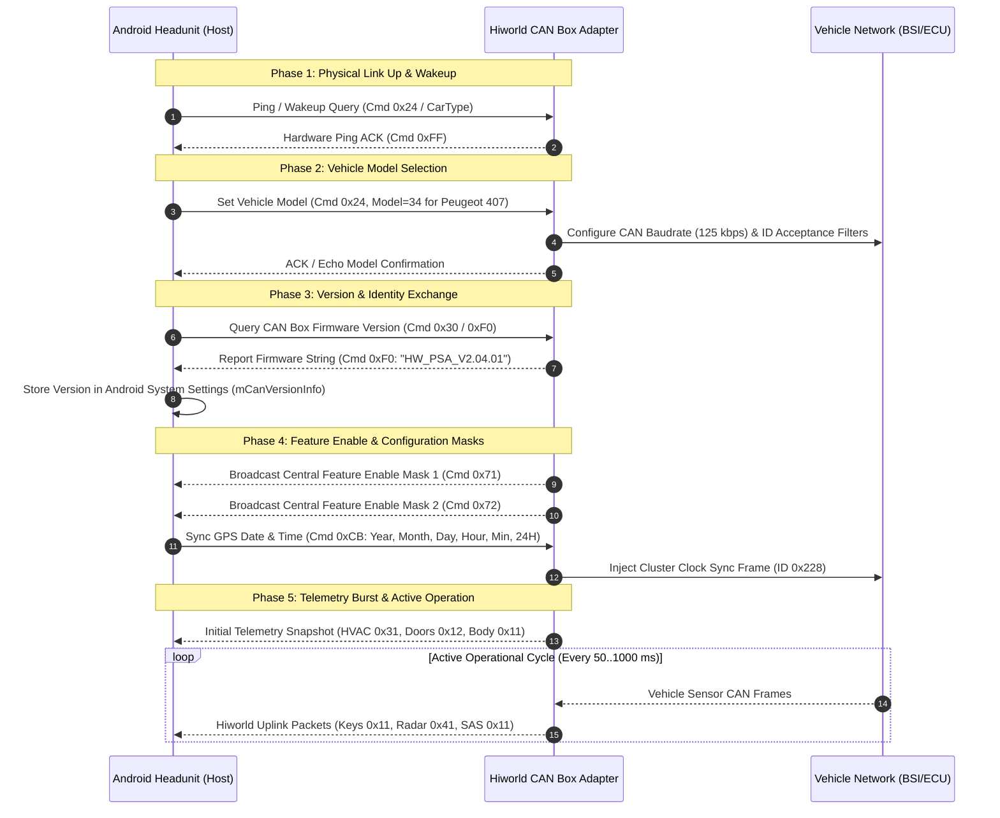

# Generic Hiworld (WC / 0x5AA5) CAN Box Protocol Specification
## Master Reference: Link Architecture, Initialization, Handshake & Vehicle Model Configuration

**Document File:** `CANBOX_SPEC_HIWORLD_GENERIC_CONNECTION_PHASE.md`  
**Document Version:** 1.0.0  
**Target Architecture:** Automotive Android Infotainment SoC (UIS7862 / SC9863A / Android 10–13) $\longleftrightarrow$ CAN Box Microcontroller (ARM Cortex-M / NUC131 / ESP32)  
**Standard Reference:** ISO/IEC 9899:1999 (Pure C99) & Android Automotive Framework (`com.qf.vehicle.supplier.wc`)  
**Suppliers Covered:** Hiworld (WC), SimpleSoft (XP/XinCheng 5AA5 dialect), Bagoo (5AA5 mode)

---

# Table of Contents
1. [Physical Layer & Multi-Layer Framing Architecture](#1-physical-layer--multi-layer-framing-architecture)
   - 1.1 UART Serial Configuration
   - 1.2 Multi-Layer Transport & MCU Tunneling
   - 1.3 `0x5A 0xA5` Frame Structure & Byte-Level Serialization
   - 1.4 Checksum Algorithms & Edge-Case Rules
   - 1.5 Frame Synchronization & Recovery Engine
2. [Connection & Initialization Phase (Step-by-Step Handshake)](#2-connection--initialization-phase-step-by-step-handshake)
   - 2.1 Complete Connection Sequence Diagram
   - 2.2 Phase 1: Physical Link Up & Handshake Ping
   - 2.3 Phase 2: Vehicle Model Configuration (`ForwardCarType` / `Cmd 0x24`)
   - 2.4 Phase 3: Firmware & Software Version Exchange (`CanBoxVersion` / `Cmd 0xF0`)
   - 2.5 Phase 4: CAN Box Hardware Type & Feature Enable Masks (`Cmd 0x71` / `0x72`)
   - 2.6 Phase 5: Initial Parameter Synchronization & Periodic Heartbeat
3. [Master Vehicle Model Code Table](#3-master-vehicle-model-code-table)
4. [Master Command ID Dictionary (Uplink & Downlink)](#4-master-command-id-dictionary-uplink--downlink)
5. [Pure C99 Protocol Driver & Connection State Machine](#5-pure-c99-protocol-driver--connection-state-machine)
   - 5.1 Protocol Header & Data Structures (`hiworld_connection.h`)
   - 5.2 Streaming Parser & State Machine Engine (`hiworld_connection.c`)
6. [Desktop Test Harness & Verification Vector Traces](#6-desktop-test-harness--verification-vector-traces)

---

# 1. Physical Layer & Multi-Layer Framing Architecture

The **Hiworld (WC)** CAN bus protocol governs bidirectional communication between the vehicle-side CAN box microcontroller and the Android headunit (HU).

```
+------------------------------------------------------------------------------------+
|                         Android Infotainment SoC (Host OS)                         |
|            QF_Canbus.apk / com.qf.vehicle.supplier.wc.WcComDataParser              |
+------------------------------------------------------------------------------------+
                                          │
                        [Android Binder / Shared Memory]
                                          ▼
+------------------------------------------------------------------------------------+
|                         Android MCU Subsystem (Hardware MCU)                       |
|         McuManagerService — Tunneling Packets via Command 0x40 (Tx) / 0x41 (Rx)     |
+------------------------------------------------------------------------------------+
                                          │
                         [Physical UART: 38400 bps, 8N1]
                                          ▼
+------------------------------------------------------------------------------------+
|                         Hiworld CAN Box Microcontroller                            |
|             (Translates Vehicle CAN 2.0A/B to/from 0x5AA5 Serial Protocol)          |
+------------------------------------------------------------------------------------+
                                          │
                           [ISO 11898 CAN-H / CAN-L]
                                          ▼
+------------------------------------------------------------------------------------+
|                            Vehicle CAN Network (BSI / ECUs)                        |
+------------------------------------------------------------------------------------+
```

### 1.1 UART Serial Configuration
- **Baud Rate:** `38400 bps` (Standard) or `115200 bps` (High-speed bus / IAP update mode)
- **Data Bits:** `8`
- **Parity:** `None`
- **Stop Bits:** `1`
- **Flow Control:** None (Framing with checksum integrity)

### 1.2 Multi-Layer Transport & MCU Tunneling
When communicating through an intermediate MCU (common on UIS7862 / TS10 headunits), the 0x5AA5 frame is encapsulated within an outer MCU transport envelope:
- **Tx Envelope (Host $\to$ CAN Box):** `0xFF 0xFD 0xFE <TotalLen> 0x01 0x40 <0x5AA5 Frame> <XOR_Checksum> 0xFF`
- **Rx Envelope (CAN Box $\to$ Host):** `0xFF 0xFD 0xFE <TotalLen> 0x01 0x41 <0x5AA5 Frame> <XOR_Checksum> 0xFF`

On systems with direct serial access (USB-to-UART or direct SoC UART), raw `0x5AA5` frames are sent directly over the wire.

### 1.3 `0x5A 0xA5` Frame Structure & Byte-Level Serialization

```
+--------+--------+--------+--------+-----------------------+----------+
| Byte 0 | Byte 1 | Byte 2 | Byte 3 | Byte 4 .. (L + 3)     | Byte L+4 |
+--------+--------+--------+--------+-----------------------+----------+
| Sync 1 | Sync 2 | Length | Cmd ID |     Payload Data      | Checksum |
|  0x5A  |  0xA5  |  (L)   | (Type) |      (L bytes)        |  1 Byte  |
+--------+--------+--------+--------+-----------------------+----------+
```

- **Sync Header (Bytes 0–1):** Fixed 2-byte preamble `0x5A 0xA5` (`90`, `-91` signed).
- **Length ($L$, Byte 2):** Number of payload data bytes (`bArr[2] = PayloadLength`). *Note: Total frame length on the wire is $L + 5$ bytes.*
- **Command ID / Data Type (Byte 3):** Identifies the function, telemetry domain, or control request.
- **Payload Data (Bytes 4 to $L+3$):** Command-specific data parameters.
- **Checksum (Byte $L+4$):** 8-bit verification byte.

### 1.4 Checksum Algorithms & Edge-Case Rules

The authoritative Hiworld checksum formula (decompiled from `WcVehicleDataRuleHead5aa5.calCheckSum`) computes the additive sum across all bytes from Byte 2 (Length) through Byte $L+3$ (last payload byte), minus 1, modulo 256:

$$\text{Checksum} = \left( \left( \sum_{i=2}^{L+3} \text{Byte}[i] \right) - 1 \right) \ \& \ \text{0xFF}$$

*Pure C99 Implementation:*
```c
uint8_t hiworld_calc_checksum(const uint8_t *frame, size_t total_len) {
    /* frame[0]=0x5A, frame[1]=0xA5, frame[2]=Length (L) */
    uint8_t payload_len = frame[2];
    uint8_t sum = 0;
    
    /* Sum from index 2 (Length) to 2 + 1 + payload_len (last payload byte) */
    for (size_t i = 2; i < (size_t)(payload_len + 4); i++) {
        sum += frame[i];
    }
    return (uint8_t)((sum - 1) & 0xFF);
}
```

---

# 2. Connection & Initialization Phase (Step-by-Step Handshake)

### 2.1 Complete Connection Sequence Diagram



---

### 2.2 Phase 1: Physical Link Up & Handshake Ping
When Android boots or the USB/UART interface connects:
1. `QF_Canbus.apk` initializes `WcVehicleDataRuleHead5aa5` and opens the serial stream at 38,400 baud.
2. The Headunit checks if the CAN Box is responsive by dispatching periodic vehicle model configuration frames (`forwardCurrentCarType`).
3. If no valid `0x5AA5` response is received within 3000 ms, the host resends the handshake frame.

---

### 2.3 Phase 2: Vehicle Model Configuration (`ForwardCarType` / `Cmd 0x24`)
The headunit informs the CAN box which vehicle brand, platform, and model profile to load.

- **Sync Header:** `0x5A 0xA5`
- **Length ($L$):** `0x02` (2 bytes)
- **Command ID:** `0x24` (`36` decimal)
- **Payload:**
  - `Byte 0`: `VehicleModelCode` (See Master Vehicle Code Table below)
  - `Byte 1`: `SubVariant / OptionsMask` (`0x00` = Default trim, `0x01` = High trim with amplifier)
- **Checksum:** `(0x02 + 0x24 + Model + Options - 1) & 0xFF`

#### Example Packet (Configuring Peugeot 407, Code = 34 / 0x22):
```
5A A5 02 24 22 00 47
│  │  │  │  │  │  └── Checksum: (0x02 + 0x24 + 0x22 + 0x00 - 1) & 0xFF = 0x47
│  │  │  │  └──┴───── Payload: Model 34 (Peugeot 407), Subvariant 0
│  │  │  └─────────── Command ID: 0x24 (Set Vehicle Model)
│  │  └────────────── Length: 2 Bytes
└──┴───────────────── Preamble: 0x5A 0xA5
```

Upon receiving this frame, the CAN box microcontroller:
1. Configures the hardware CAN controller baud rate (125 kbps for Peugeot 407 Comfort CAN; 500 kbps for EMP2/PSA 15).
2. Sets hardware acceptance filter masks for CAN IDs `0x0F6`, `0x1D0`, `0x220`, `0x21F`, `0x0E6`, `0x1A0`, `0x225`, `0x385`.
3. Activates the corresponding telemetry translation tables.

---

### 2.4 Phase 3: Firmware & Software Version Exchange (`CanBoxVersion` / `Cmd 0xF0`)
The headunit displays the CAN adapter's firmware version string in the **Factory / Vehicle Settings** menu.

- **Uplink Command ID:** `0xF0` (`-16` signed / `240` decimal / `Handle.CanBoxVersion`)
- **Payload:** ASCII String ($N$ bytes, e.g. `"HW_PSA_V2.04.01"`)
- **Length ($L$):** Length of ASCII string (e.g. `15` bytes)

#### Example Packet (CAN Box reporting firmware string `"HW_PSA_V2.04"`):
```
5A A5 0B F0 48 57 5F 50 53 41 5F 56 32 2E 30 34 E6
│  │  │  │  └───────────────────────────────────┘ └── Checksum
│  │  │  │  ASCII: "HW_PSA_V2.04" (11 bytes)
│  │  │  └─ Command ID: 0xF0 (CanBox Version)
│  │  └──── Length: 11 (0x0B)
└──┴─────── Preamble: 0x5A 0xA5
```

When parsed by `PeugeotDataParser.parseCanboxVersion`:
```java
private static void parseCanboxVersion(AbsVehicleDataRule rule, byte[] bArr, OnDataChangeCallBack cb) {
    cb.notifyCanboxVersion(new String(bArr, rule.getDataStartIndex(), rule.getDataLength(bArr)));
}
```

---

### 2.5 Phase 4: CAN Box Hardware Type & Feature Enable Masks (`Cmd 0x71` / `0x72`)
To inform the Android user interface which vehicle features should be displayed (e.g. hiding the JBL Amplifier menu on cars without an amplifier, or showing the DRL option), the CAN box transmits Feature Enable bitmasks.

- **Command ID `0x71` (`113` dec - `CentralStateEnable1`):**
  - Bit 7: Atmosphere Lighting enabled
  - Bit 6: Welcome Light timer enabled
  - Bit 5: Parking Radar switch available
  - Bit 4: Auto Door Locking menu available
  - Bit 3: Rear Wiper in Reverse available
  - Bit 2: Daytime Running Lights (DRL) toggle available
  - Bit 1..0: Follow-Me-Home timer options available
- **Command ID `0x72` (`114` dec - `CentralStateEnable2`):**
  - Bit 7: Power Mirror Auto-fold available
  - Bit 6: Blind Spot Monitoring (SAM) available
  - Bit 5: Fatigue warning available
  - Bit 4: Lane Keep Assist available
  - Bit 3: Electric Tailgate available
  - Bit 2: Seat Massage available
  - Bit 1: TPMS Calibration reset button enabled
  - Bit 0: Drive Mode selection enabled

---

### 2.6 Phase 5: Initial Parameter Synchronization & Periodic Heartbeat
After vehicle model acknowledgment, the headunit immediately pushes global parameters:
1. **System Date & Time (`Cmd 0xCB` / `-53` signed):** Year (0..99), Month (1..12), Day (1..31), Hour (0..23), Minute (0..59), Format (1=24H).
2. **System Language (`Cmd 0x9A` / `-102` signed):** Language ID (`0x00`=English, `0x01`=Chinese, `0x02`=French, `0x03`=German, `0x04`=Spanish, `0x05`=Italian).
3. **Master Measurement Units (`Cmd 0xCA` / `-54` signed):** Distance unit (km/mi), Consumption unit (L/100km, MPG), Temperature unit (°C/°F), Pressure unit (Bar/PSI/kPa).

---

# 3. Master Vehicle Model Code Table

Decompiled from `PeugeotDataDefine.adaptCurrentCarCommand`:

| Model Code (Dec) | Model Code (Hex) | Target Vehicle Platform | Supported CAN Bus Speed | Notes |
|:---:|:---:|:---|:---:|:---|
| `1` | `0x01` | Citroën C-Quatre (2008+) | 125 kbps | Comfort CAN |
| `2` | `0x02` | Citroën C4 / Quatre (2016+) | 125 kbps | Comfort CAN |
| `3` | `0x03` | Citroën C4L (2013+) | 125 kbps | Comfort CAN |
| `4` | `0x04` | Citroën C5 (2010+) | 125 kbps | Comfort CAN |
| `5` | `0x05` | Citroën C5 (2013+) | 125 kbps | Comfort CAN |
| `6` | `0x06` | Peugeot 307 (2004–2011) | 125 kbps | CAN 2004 VAN-to-CAN |
| `7` | `0x07` | Peugeot 308 (2012–2016) | 125 kbps | Comfort CAN |
| `8` | `0x08` | Peugeot 408 (2010+) | 125 kbps | Comfort CAN |
| `9` | `0x09` | Peugeot 508 Low-Trim (2011+) | 125 kbps | Comfort CAN |
| `10` | `0x0A` | Peugeot 508 High-Trim (2011+) | 125 kbps | With JBL Amplifier |
| `11` | `0x0B` | Peugeot 3008 (2013+) | 125 kbps | Comfort CAN |
| `12` | `0x0C` | Citroën DS5 (2012+) | 125/500 kbps | Dual CAN |
| `13` | `0x0D` | Citroën DS5LS (2012+) | 125/500 kbps | Dual CAN |
| `14` | `0x0E` | Peugeot 2008 (2014+) | 125/500 kbps | PSA 15 AEE2010 |
| `15` | `0x0F` | Citroën DS4 (2012+) | 125/500 kbps | Dual CAN |
| `16` | `0x10` | Peugeot 308S / 408 (2014–2019) | 500 kbps | PSA 15 EMP2 Platform |
| `17` | `0x11` | Peugeot 3008 Keep-Screen (2013) | 125 kbps | Comfort CAN |
| `18` | `0x12` | Peugeot 301 / Citroën C-Elysée | 125 kbps | Low-cost BSI |
| `19` | `0x13` | Citroën C3-XR (2015+) | 125 kbps | Comfort CAN |
| `20` | `0x14` | Peugeot 4008 / 5008 (2017+) | 500 kbps | PSA 15 EMP2 Platform |
| `21` | `0x15` | Peugeot 508 Facelift (2015+) | 500 kbps | High-line NAC/DSP |
| `22` | `0x16` | Citroën DS6 (2016+) | 500 kbps | Dual CAN |
| `23` | `0x17` | Peugeot 301 (2019+) | 125/500 kbps | Facelift |
| `24` | `0x18` | Peugeot Rifter High (2019+) | 500 kbps | EMP2 Platform |
| `25` | `0x19` | Peugeot Rifter Low (2019+) | 500 kbps | EMP2 Platform |
| `32` | `0x20` | Citroën Tianyi C5 Aircross (2017+) | 500 kbps | EMP2 Platform |
| `33` | `0x21` | Peugeot 308 CC (2011+) | 125 kbps | Coupe-Cabriolet |
| **34** | **`0x22`** | **Peugeot 407 (2004–2011)** | **125 kbps** | **PSA CAN 2004 Comfort** |
| `35` | `0x23` | Opel Combo / Corsa / Grandland | 500 kbps | PSA Platform |
| `36` | `0x24` | Citroën C3 (2023+) | 500 kbps | CMP Platform |
| `37` | `0x25` | Citroën C4 (2009+) | 125 kbps | Comfort CAN |
| `38` | `0x26` | Peugeot 3008 (2022+) | 500 kbps | Facelift |
| `39` | `0x27` | Peugeot Partner (2009+) | 125 kbps | Utility CAN |
| `40` | `0x28` | Citroën Berlingo (2017+) | 500 kbps | EMP2 Platform |

---

# 4. Master Command ID Dictionary (Uplink & Downlink)

### Inbound Uplink Commands (CAN Box $\to$ Android Headunit)
| Command ID (Hex) | Dec / Signed | Constant Identifier | Functional Description |
|:---:|:---:|:---|:---|
| **`0x11`** | `17` | `Handle.CarBaseInfo` | Steering Wheel Keys, Rotary Scroll & Steering Angle ($0.1^\circ$) |
| **`0x12`** | `18` | `Handle.DoorWindowState` | Discrete Door Openings (FL, FR, RL, RR, Trunk, Hood) |
| **`0x13`** | `19` | `Handle.EcuInfoPage1` | Trip Computer: Instantaneous Consumption & Cruising Range |
| **`0x14`** | `20` | `Handle.EcuInfoPage2` | Trip Computer: Trip 1 Distance, Average Speed & Fuel |
| **`0x15`** | `21` | `Handle.EcuInfoPage3` | Trip Computer: Trip 2 Distance, Average Speed & Fuel |
| **`0x21`** | `33` | `Handle.ControlPanelKey` | Physical Center Console Buttons |
| **`0x22`** | `34` | `Handle.ControlPanelKnob` | Physical Rotary Encoder Knobs (Volume / Tune / Menu) |
| **`0x31`** | `49` | `Handle.CarAcState` | Dual-Zone Climate Control Telemetry ($14.0 \dots 30.0^\circ\text{C}$, Fan 0..8) |
| **`0x41`** | `65` | `Handle.CarRadarState` | 8-Sensor Ultrasonic Parking Radar (4 Front + 4 Rear Levels 0..10) |
| **`0x42`** | `66` | `Handle.WarningInfo` | Vehicle System Diagnostic Fault Warnings & Check Engine Alerts |
| **`0x71`** | `113` | `Handle.CentralStateEnable1` | Feature Availability Bitmask Page 1 (Lighting, Locks, Wipers) |
| **`0x72`** | `114` | `Handle.CentralStateEnable2` | Feature Availability Bitmask Page 2 (Mirrors, ADAS, TPMS Reset) |
| **`0x76`** | `118` | `Handle.CentralState1` | BSI Personalization State Feedback Page 1 |
| **`0x79`** | `121` | `Handle.CentralState` | BSI Personalization State Feedback Page 2 |
| **`0x97`** | `-105` (`151`) | `Handle.CarMediaState` | RD4 CD Changer Track, Disc, Duration & Playback Status |
| **`0x93`** | `-109` (`147`) | `Handle.HostInfo` | Radio Mode & Master Volume Status |
| **`0xC1`** | `-63` (`193`) | `Handle.UnitInfo` | Measurement Units Feedback (Distance, Temp, Fuel, Pressure) |
| **`0xC2`** | `-62` (`194`) | `Handle.DateTimeInfo` | Vehicle Calendar & Clock Feedback |
| **`0xF0`** | `-16` (`240`) | `Handle.CanBoxVersion` | CAN Box Hardware & Firmware ASCII Version String |

### Outbound Downlink Commands (Android Headunit $\to$ CAN Box)
| Command ID (Hex) | Dec / Signed | Constant Identifier | Functional Description |
|:---:|:---:|:---|:---|
| **`0x24`** | `36` | `Command.ForwardCarType` | Vehicle Model Code Configuration (e.g. `34` = Peugeot 407) |
| **`0x1B`** | `27` | `Command.ForwardEcuSetting` | Trip Computer Reset Page Selection (Trip 1 / Trip 2) |
| **`0x3B`** | `59` | `Command.ForwardAcSetting` | Touchscreen Climate Control Overrides (Temp, Fan, Airflow) |
| **`0x7B`** | `123` | `Command.ForwardCentralState1` | BSI Personalization Option Overrides (DRL, Auto-Lock, Wipers) |
| **`0x7D`** | `125` | `Command.ForwardCentralState2` | Extended ADAS, Mirror Fold & Lighting Overrides |
| **`0x8B`** | `-117` (`139`)| `Command.ForwardCruiseSpeedCmd` | Memorized Cruise Speed Limits Configuration ($M_1 \dots M_5$) |
| **`0x8A`** | `-118` (`138`)| `Command.ForwardSpeedValueCmd` | Speed Limiter Threshold Adjustments |
| **`0x9A`** | `-102` (`154`)| `Command.ForwardLanguageSetting` | Vehicle System Language Configuration |
| **`0xA1`** | `-95` (`161`)| `Command.ForwardHostState` | Master Headunit Power & Screen State |
| **`0xA2`** | `-94` (`162`)| `Command.ForwardTunerCmd` | Radio Tuner Frequency & Band Control |
| **`0xA4`** | `-92` (`164`)| `Command.ForwardCdCmd` | CD / CDC Playback Control (Track Next/Prev, Disc Select) |
| **`0xAD`** | `-83` (`173`)| `Command.ForwardDspStateSetting` | JBL Amplifier Tone, EQ, Fader, Balance & Loudness Adjustments |
| **`0xCB`** | `-53` (`203`)| `Command.ForwardDateTimeSetting` | GPS Date & Time Broadcast to BSI / Instrument Cluster |
| **`0xCA`** | `-54` (`204`)| `Command.ForwardUnitSetting` | Measurement Unit Configuration (Metric / Imperial) |
| **`0xE4`** | `-28` (`228`)| `Command.ForwardId3Info` | Android Media ID3 Song Title & Artist Text Push to MFD |
| **`0xE1`** | `-31` (`225`)| `Command.ForwardHostSourceInfo` | Active Audio Source & Radio Frequency Text Push to MFD |

---

# 5. Pure C99 Protocol Driver & Connection State Machine

### 5.1 Protocol Header & Data Structures (`hiworld_connection.h`)

```c
#ifndef HIWORLD_CONNECTION_H
#define HIWORLD_CONNECTION_H

#include <stdint.h>
#include <stdbool.h>
#include <stddef.h>

#define HIWORLD_SOF1  0x5A
#define HIWORLD_SOF2  0xA5

/* Vehicle Model IDs */
#define HIWORLD_CAR_MODEL_PEUGEOT_407_06  34  /* 0x22 */
#define HIWORLD_CAR_MODEL_PEUGEOT_308_12  7   /* 0x07 */
#define HIWORLD_CAR_MODEL_PEUGEOT_508_11  9   /* 0x09 */
#define HIWORLD_CAR_MODEL_PEUGEOT_408_14  16  /* 0x10 */

/* Command IDs */
#define HIWORLD_CMD_CAR_TYPE_SET          0x24 /* 36 */
#define HIWORLD_CMD_VERSION_REPORT        0xF0 /* 240 */
#define HIWORLD_CMD_VERSION_QUERY         0x30
#define HIWORLD_CMD_DATE_TIME_SET         0xCB /* -53 */
#define HIWORLD_CMD_LANGUAGE_SET          0x9A /* -102 */
#define HIWORLD_CMD_UNIT_SET              0xCA /* -54 */
#define HIWORLD_CMD_FEATURE_ENABLE1       0x71 /* 113 */
#define HIWORLD_CMD_FEATURE_ENABLE2       0x72 /* 114 */

/* Connection State Machine States */
typedef enum {
    HIWORLD_LINK_DISCONNECTED = 0,
    HIWORLD_LINK_WAIT_MODEL   = 1,
    HIWORLD_LINK_INITIALIZED  = 2,
    HIWORLD_LINK_ACTIVE       = 3
} hiworld_link_state_t;

/* Serial and CAN Callback Types */
typedef void (*hiworld_uart_tx_fn)(const uint8_t *buf, size_t len);
typedef void (*hiworld_can_config_fn)(uint8_t car_model_id, uint32_t baud_rate);

typedef struct {
    hiworld_link_state_t state;
    uint8_t              car_model_id;
    uint8_t              car_variant;
    char                 fw_version[20];
    
    uint32_t             last_rx_millis;
    uint32_t             last_handshake_millis;
    
    hiworld_uart_tx_fn   uart_tx;
    hiworld_can_config_fn can_config;
} hiworld_connection_ctx_t;

/* Public API */
void hiworld_conn_init(hiworld_connection_ctx_t *ctx,
                       const char *fw_version_str,
                       hiworld_uart_tx_fn uart_tx,
                       hiworld_can_config_fn can_config);

void hiworld_conn_process_rx_byte(hiworld_connection_ctx_t *ctx, uint8_t byte);
void hiworld_conn_task_periodic(hiworld_connection_ctx_t *ctx, uint32_t now_millis);
void hiworld_conn_send_version(hiworld_connection_ctx_t *ctx);
void hiworld_conn_send_feature_enables(hiworld_connection_ctx_t *ctx);

#endif /* HIWORLD_CONNECTION_H */
```

---

### 5.2 Streaming Parser & State Machine Engine (`hiworld_connection.c`)

```c
#include "hiworld_connection.h"
#include <string.h>

#define RX_BUFFER_SIZE 256

typedef enum {
    PARSE_LOOK_SOF1 = 0,
    PARSE_LOOK_SOF2 = 1,
    PARSE_GET_LEN   = 2,
    PARSE_GET_CMD   = 3,
    PARSE_GET_DATA  = 4,
    PARSE_GET_CS    = 5
} parser_step_t;

static parser_step_t s_step = PARSE_LOOK_SOF1;
static uint8_t s_rx_buf[RX_BUFFER_SIZE];
static uint8_t s_payload_len = 0;
static uint8_t s_cmd_id = 0;
static uint8_t s_data_idx = 0;

static uint8_t calc_checksum(const uint8_t *frame, size_t total_len) {
    uint8_t payload_len = frame[2];
    uint8_t sum = 0;
    for (size_t i = 2; i < (size_t)(payload_len + 4); i++) {
        sum += frame[i];
    }
    return (uint8_t)((sum - 1) & 0xFF);
}

static void send_hiworld_frame(hiworld_connection_ctx_t *ctx, uint8_t cmd_id, const uint8_t *payload, uint8_t len) {
    if (!ctx->uart_tx || len > (RX_BUFFER_SIZE - 5)) return;

    uint8_t tx[RX_BUFFER_SIZE];
    tx[0] = HIWORLD_SOF1;
    tx[1] = HIWORLD_SOF2;
    tx[2] = len;
    tx[3] = cmd_id;
    if (len > 0 && payload != NULL) {
        memcpy(&tx[4], payload, len);
    }
    tx[len + 4] = calc_checksum(tx, len + 5);

    ctx->uart_tx(tx, len + 5);
}

void hiworld_conn_init(hiworld_connection_ctx_t *ctx,
                       const char *fw_version_str,
                       hiworld_uart_tx_fn uart_tx,
                       hiworld_can_config_fn can_config) {
    memset(ctx, 0, sizeof(hiworld_connection_ctx_t));
    ctx->state = HIWORLD_LINK_WAIT_MODEL;
    ctx->uart_tx = uart_tx;
    ctx->can_config = can_config;
    strncpy(ctx->fw_version, fw_version_str, sizeof(ctx->fw_version) - 1);
}

void hiworld_conn_send_version(hiworld_connection_ctx_t *ctx) {
    size_t len = strlen(ctx->fw_version);
    send_hiworld_frame(ctx, HIWORLD_CMD_VERSION_REPORT, (const uint8_t*)ctx->fw_version, (uint8_t)len);
}

void hiworld_conn_send_feature_enables(hiworld_connection_ctx_t *ctx) {
    /* Feature Enable 1 (Cmd 0x71): Lighting, Locks, Wipers, Radar available */
    uint8_t feat1[2] = { 0xFF, 0xFF };
    send_hiworld_frame(ctx, HIWORLD_CMD_FEATURE_ENABLE1, feat1, 2);

    /* Feature Enable 2 (Cmd 0x72): TPMS Reset, Mirror Fold, ADAS available */
    uint8_t feat2[2] = { 0xFB, 0xFF };
    send_hiworld_frame(ctx, HIWORLD_CMD_FEATURE_ENABLE2, feat2, 2);
}

static void handle_parsed_command(hiworld_connection_ctx_t *ctx, uint8_t cmd_id, const uint8_t *payload, uint8_t len) {
    switch (cmd_id) {
        case HIWORLD_CMD_CAR_TYPE_SET: {
            /* Headunit sets Vehicle Model */
            if (len >= 1) {
                ctx->car_model_id = payload[0];
                ctx->car_variant  = (len >= 2) ? payload[1] : 0;
                ctx->state = HIWORLD_LINK_INITIALIZED;

                /* Configure Vehicle CAN Controller accordingly */
                if (ctx->can_config) {
                    uint32_t baud = (ctx->car_model_id == HIWORLD_CAR_MODEL_PEUGEOT_407_06) ? 125000 : 500000;
                    ctx->can_config(ctx->car_model_id, baud);
                }

                /* Acknowledge connection: Send Version and Feature Enables */
                hiworld_conn_send_version(ctx);
                hiworld_conn_send_feature_enables(ctx);

                ctx->state = HIWORLD_LINK_ACTIVE;
            }
            break;
        }

        case HIWORLD_CMD_VERSION_QUERY: {
            /* Explicit version request from Android Factory menu */
            hiworld_conn_send_version(ctx);
            break;
        }

        case HIWORLD_CMD_DATE_TIME_SET: {
            /* GPS Time received from Android */
            /* Forward to vehicle cluster calendar frame (ID 0x228) */
            break;
        }

        default:
            break;
    }
}

void hiworld_conn_process_rx_byte(hiworld_connection_ctx_t *ctx, uint8_t byte) {
    switch (s_step) {
        case PARSE_LOOK_SOF1:
            if (byte == HIWORLD_SOF1) s_step = PARSE_LOOK_SOF2;
            break;

        case PARSE_LOOK_SOF2:
            if (byte == HIWORLD_SOF2) {
                s_step = PARSE_GET_LEN;
            } else if (byte != HIWORLD_SOF1) {
                s_step = PARSE_LOOK_SOF1;
            }
            break;

        case PARSE_GET_LEN:
            s_payload_len = byte;
            s_rx_buf[0] = HIWORLD_SOF1;
            s_rx_buf[1] = HIWORLD_SOF2;
            s_rx_buf[2] = byte;
            s_step = PARSE_GET_CMD;
            break;

        case PARSE_GET_CMD:
            s_cmd_id = byte;
            s_rx_buf[3] = byte;
            s_data_idx = 0;
            if (s_payload_len == 0) {
                s_step = PARSE_GET_CS;
            } else {
                s_step = PARSE_GET_DATA;
            }
            break;

        case PARSE_GET_DATA:
            s_rx_buf[4 + s_data_idx] = byte;
            s_data_idx++;
            if (s_data_idx >= s_payload_len) {
                s_step = PARSE_GET_CS;
            }
            break;

        case PARSE_GET_CS: {
            uint8_t expected_cs = byte;
            s_rx_buf[4 + s_payload_len] = expected_cs;
            uint8_t actual_cs = calc_checksum(s_rx_buf, s_payload_len + 5);

            if (expected_cs == actual_cs) {
                ctx->last_rx_millis = 0; /* Updated by caller */
                handle_parsed_command(ctx, s_cmd_id, &s_rx_buf[4], s_payload_len);
            }
            s_step = PARSE_LOOK_SOF1;
            break;
        }
    }
}

void hiworld_conn_task_periodic(hiworld_connection_ctx_t *ctx, uint32_t now_millis) {
    /* If waiting for model configuration from HU, periodically ping with firmware string */
    if (ctx->state == HIWORLD_LINK_WAIT_MODEL) {
        if (now_millis - ctx->last_handshake_millis >= 1000) {
            ctx->last_handshake_millis = now_millis;
            hiworld_conn_send_version(ctx);
        }
    }
}
```

---

# 6. Desktop Test Harness & Verification Vector Traces

### Vector 1: Headunit Sets Vehicle Model to Peugeot 407 (Model 34 / 0x22)
- **Downlink Serial Received (Host $\to$ CAN Box):**
  ```
  Hex Trace: 5A A5 02 24 22 00 47
  ```
  - Preamble: `5A A5`
  - Length: `0x02`
  - Command: `0x24` (`HIWORLD_CMD_CAR_TYPE_SET`)
  - Payload: Model ID = `0x22` (34 dec = Peugeot 407), Variant = `0x00`
  - Checksum: `(0x02 + 0x24 + 0x22 + 0x00 - 1) & 0xFF = 0x47`

### Vector 2: CAN Box Acknowledges and Transmits Firmware Version
- **Uplink Serial Transmitted (CAN Box $\to$ Host):**
  ```
  Hex Trace: 5A A5 0B F0 48 57 5F 50 53 41 5F 56 32 2E 30 E2
  ```
  - Preamble: `5A A5`
  - Length: `11` (`0x0B`)
  - Command: `0xF0` (`HIWORLD_CMD_VERSION_REPORT`)
  - Payload (ASCII): `"HW_PSA_V2.0"` (`48 57 5F 50 53 41 5F 56 32 2E 30`)
  - Checksum: `0xE2`

### Vector 3: CAN Box Broadcasts Feature Enable Bitmasks
- **Uplink Serial Transmitted (`Cmd 0x71` & `0x72`):**
  ```
  Frame 1: 5A A5 02 71 FF FF 71
  Frame 2: 5A A5 02 72 FB FF 6E
  ```
  - Checksum 1: `(0x02 + 0x71 + 0xFF + 0xFF - 1) & 0xFF = 0x71`
  - Checksum 2: `(0x02 + 0x72 + 0xFB + 0xFF - 1) & 0xFF = 0x6E`

### Vector 4: Headunit Synchronizes GPS Clock (22 Sept 2026, 15:30, 24H)
- **Downlink Serial Received (Host $\to$ CAN Box):**
  ```
  Hex Trace: 5A A5 06 CB 1A 09 16 0F 1E 01 4B
  ```
  - Preamble: `5A A5`
  - Length: `6` (`0x06`)
  - Command: `0xCB` (`HIWORLD_CMD_DATE_TIME_SET`)
  - Payload: Year 2026 (`0x1A`), Month 9 (`0x09`), Day 22 (`0x16`), Hour 15 (`0x0F`), Min 30 (`0x1E`), 24H mode (`0x01`)
  - Checksum: `(0x06 + 0xCB + 0x1A + 0x09 + 0x16 + 0x0F + 0x1E + 0x01 - 1) & 0xFF = 0x4B`
  - **Action:** Microcontroller injects PSA CAN ID `0x228#0F1E16091A000000` onto the vehicle bus.

